# 爬虫入门

## 爬虫的矛与盾

反爬机制
    门户网站，可以通过制定相应的策略或者技术手段，防止爬虫程序进行网站数据的爬取。

反反爬策略
    爬虫程序可以通过制定相关的策略或者技术手段，破解门户网站中具备的反爬机制，从而可以获取门户网站中相关的数据。

robots.txt协议：百度蜘蛛
    君子协议。规定了网站中哪些数据可以被爬虫爬取哪些数据不可以被爬取。

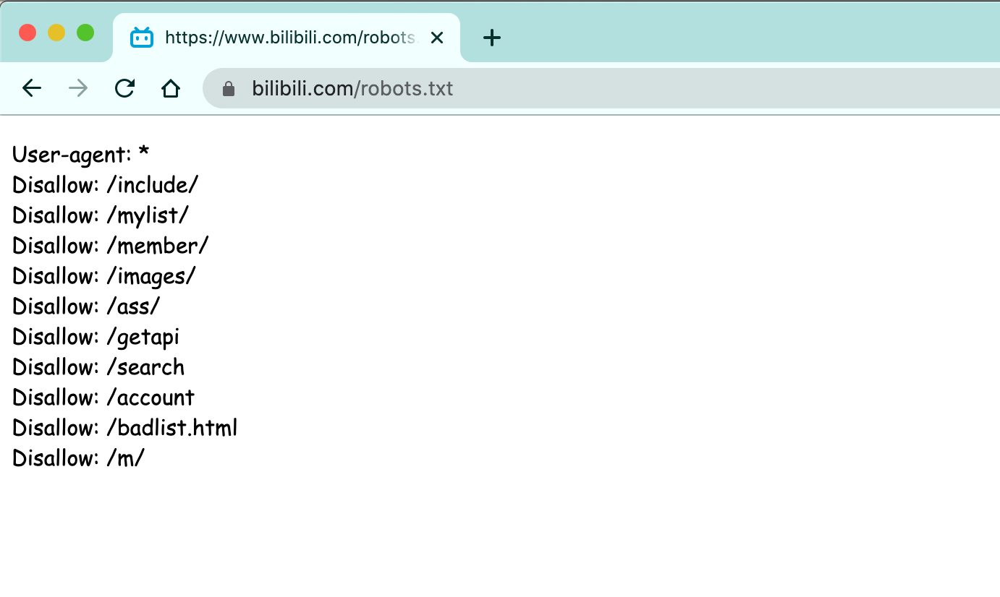


## 第一个爬虫

首先,我们还是需要回顾一下爬虫的概念. 爬虫就是我们通过我们写的程序去抓取互联网上的数据资源. 比如, 此时我需要百度的资源. 在不考虑爬虫的情况下, 我们肯定是打开浏览器, 然后输入百度的网址, 紧接着, 我们就能在浏览器上看到百度的内容了.  那换成爬虫呢? 其实道理是一样的. 只不过, 我们需要用代码来模拟一个浏览器, 然后同样的输入百度的网址. 那么我们的程序应该也能拿到百度的内容. 对吧~

在python中, 我们可以直接用urllib模块来完成对浏览器的模拟工作~, 直接上代码

```python
from urllib.request import urlopen

resp = urlopen("http://www.baidu.com")  # 打开 百度
print(resp.read().decode("utf-8"))  # 打印 抓取到的内容
```

是不是很简单呢?

我们可以把抓取到的html内容全部写入到文件中, 然后和原版的百度进行对比, 看看是否一致

```python
from urllib.request import urlopen

resp = urlopen("http://www.baidu.com")  # 打开 百度

# print(resp.read().decode("utf-8"))  # 打印 抓取到的内容

with open("baidu.html", mode="w", encoding="utf-8") as f:  # 创建文件
    f.write(resp.read().decode("utf-8"))  # 保存在文件中
```

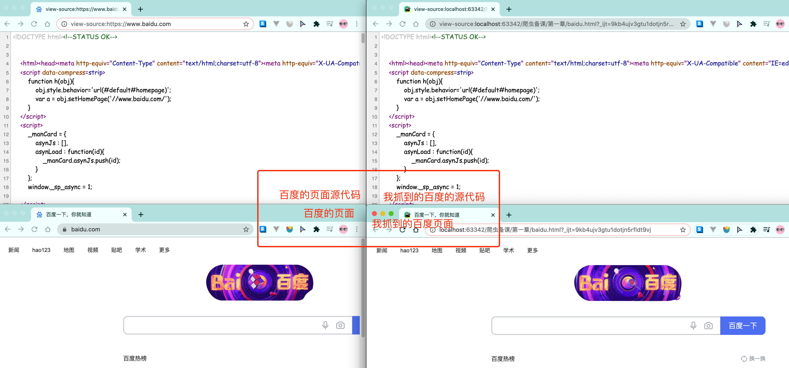

OK ~ 我们成功的从百度上爬取到了一个页面的源代码. 就是这么简单, 就是这么炫酷. 

你也试一下吧~   


## web请求全过程剖析(重点)

上一小节我们实现了一个网页的整体抓取工作. 那么本小节, 给各位好好剖析一下web请求的全部过程, 这样有助于后面我们遇到的各种各样的网站就有了入手的基本准则了. 

那么到底我们浏览器在输入完网址到我们看到网页的整体内容, 这个过程中究竟发生了些什么?

这里我们以百度为例.  在访问百度的时候, 浏览器会把这一次请求发送到百度的服务器(百度的一台电脑), 由服务器接收到这个请求, 然后加载一些数据. 返回给浏览器, 再由浏览器进行显示. 听起来好像是个废话...但是这里蕴含着一个极为重要的东西在里面, 注意, 百度的服务器返回给浏览器的不直接是页面, 而是页面源代码(由html, css, js组成). 由浏览器把页面源代码进行执行, 然后把执行之后的结果展示给用户. 所以我们能看到在上一节的内容中,我们拿到的是百度的源代码(就是那堆看不懂的鬼东西). 具体过程如图.

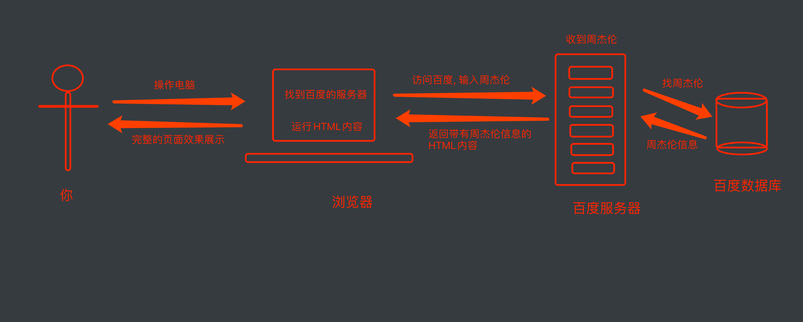

接下来就是一个比较重要的事情了. 所有的数据都在页面源代码里么? 非也~ 这里要介绍一个新的概念

那就是页面渲染数据的过程, 我们常见的页面渲染过程有两种, 

1. 服务器渲染, 你需要的数据直接在页面源代码里能搜到

   这个最容易理解, 也是最简单的. 含义呢就是我们在请求到服务器的时候, 服务器直接把数据全部写入到html中, 我们浏览器就能直接拿到带有数据的html内容. 比如, 

   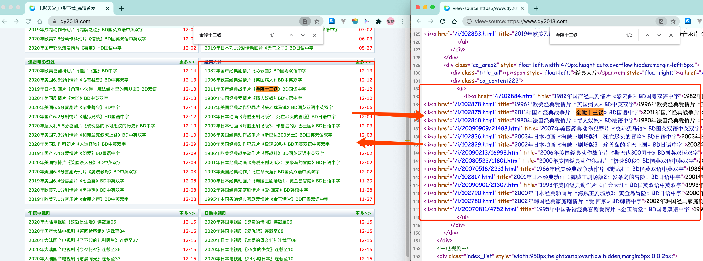

   由于数据是直接写在html中的, 所以我们能看到的数据都在页面源代码中能找的到的. 

   这种网页一般都相对比较容易就能抓取到页面内容. 

2. 前端JS渲染, 你需要的数据在页面源代码里搜不到

   这种就稍显麻烦了. 这种机制一般是第一次请求服务器返回一堆HTML框架结构. 然后再次请求到真正保存数据的服务器, 由这个服务器返回数据, 最后在浏览器上对数据进行加载. 就像这样:

   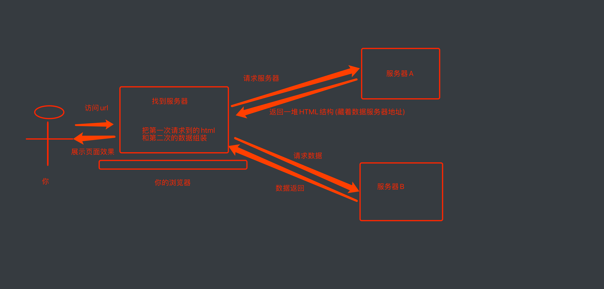

   这样做的好处是服务器那边能缓解压力. 而且分工明确. 比较容易维护. 典型的有这么一个网页

   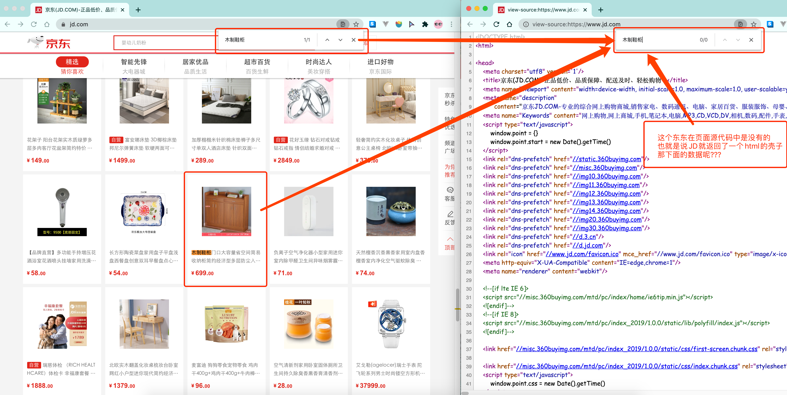

   

   那数据是何时加载进来的呢?  其实就是在我们进行页面向下滚动的时候, jd就在偷偷的加载数据了, 此时想要看到这个页面的加载全过程, 我们就需要借助浏览器的调试工具了(F12)

   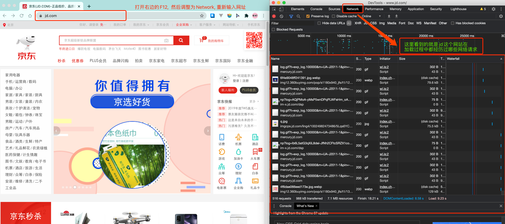

   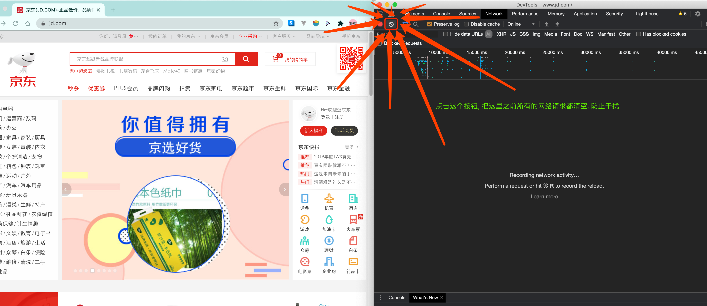

   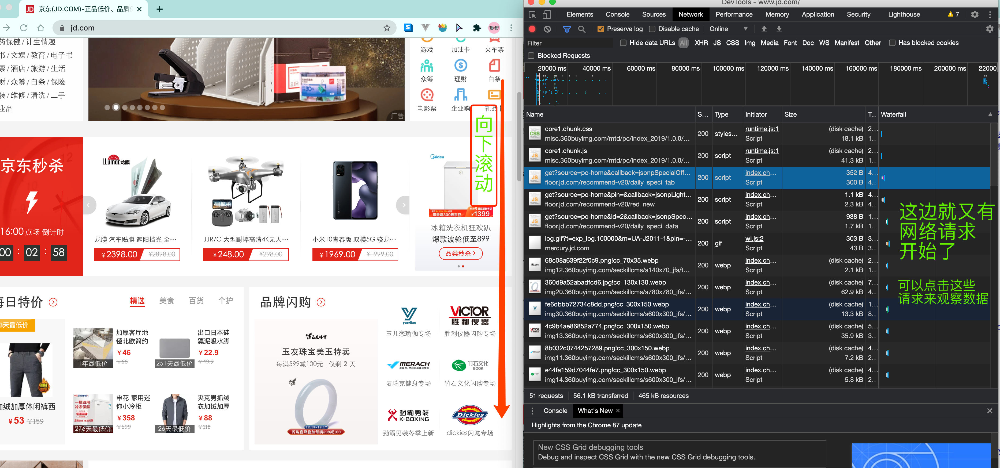

   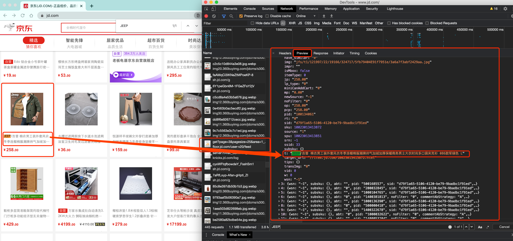

   看到了吧, 页面上看到的内容其实是后加载进来的. 

OK, 在这里我不是要跟各位讲jd有多牛B, 也不是说这两种方式有什么不同, 只是想告诉各位, 有些时候, 我们的数据不一定都是直接来自于页面源代码.  如果你在页面源代码中找不到你要的数据时, 那很可能数据是存放在另一个请求里. 

```
1.你要的东西在页面源代码. 直接拿`源代码`提取数据即可
2.你要的东西，不在页面源代码, 需要想办法找到真正的加载数据的那个请求. 然后提取数据
```


## 浏览器工具的使用(重点)

Chrome是一款非常优秀的浏览器. 不仅仅体现在用户使用上. 对于我们开发人员而言也是非常非常好用的. 

对于一名爬虫工程师而言. 浏览器是最能直观的看到网页情况以及网页加载内容的地方. 我们可以按下F12来查看一些普通用户很少能使用到的工具. 

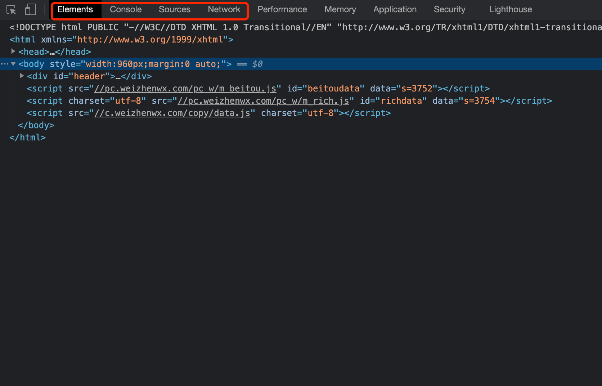

其中, 最重要的Elements, Console, Sources, Network. 

Elements是我们实时的网页内容情况, 注意, 很多兄弟尤其到了后期. 非常容易混淆Elements以及页面源代码之间的关系. 

> 注意,  
>
> 1. 页面源代码是执行js脚本以及用户操作之前的服务器返回给我们最原始的内容
> 2. Elements中看到的内容是js脚本以及用户操作之后的当时的页面显示效果. 

你可以理解为, 一个是老师批改之前的卷子, 一个是老师批改之后的卷子. 虽然都是卷子. 但是内容是不一样的. 而我们目前能够拿到的都是页面源代码. 也就是老师批改之前的样子. 这一点要格外注意. 

在Elements中我们可以使用左上角的小箭头.可以直观的看到浏览器中每一块位置对应的当前html状况. 还是很贴心的. 

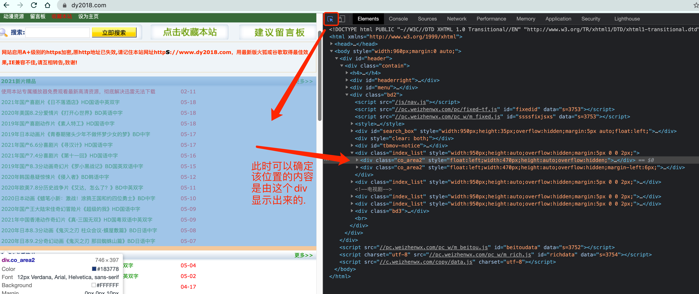


第二个窗口, Console是用来查看程序员留下的一些打印内容, 以及日志内容的. 我们可以在这里输入一些js代码自动执行. 


等咱们后面讲解js逆向的时候会用到这里.


第三个窗口, Source, 这里能看到该网页打开时加载的所有内容. 包括页面源代码. 脚本. 样式, 图片等等全部内容. 

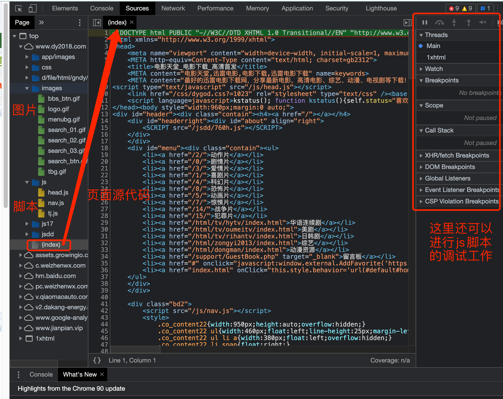


第四个窗口, Network, 我们一般习惯称呼它为抓包工具. 在这里, 我们能看到当前网页加载的所有网路网络请求, 以及请求的详细内容. 这一点对我们爬虫来说至关重要. 

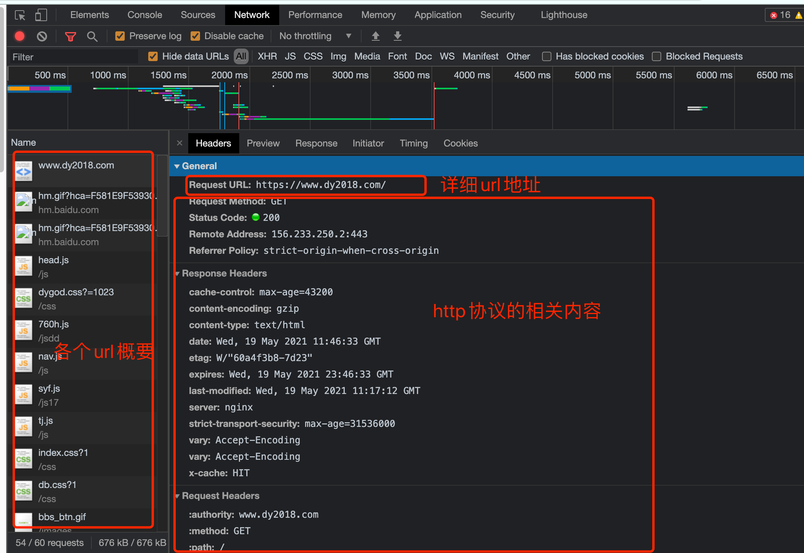

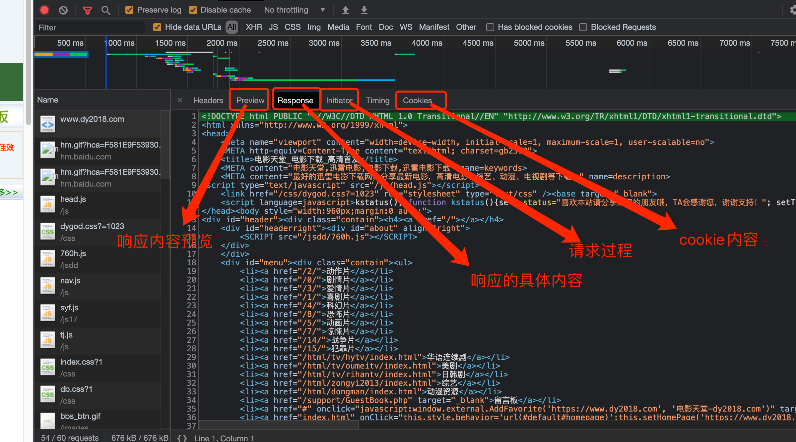

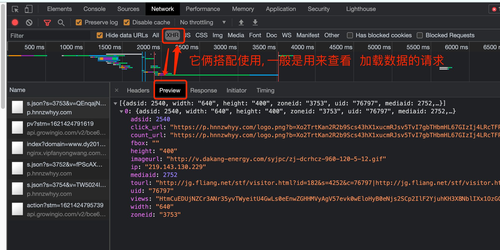

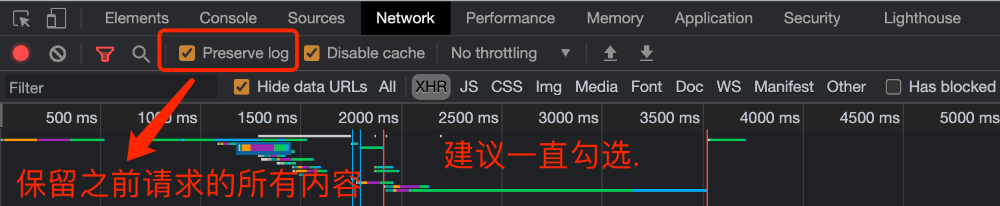


其他更加具体的内容. 随着咱们学习的展开. 会逐一进行讲解. 


## HTTP协议

协议: 就是两个计算机之间为了能够流畅的进行沟通而设置的一个君子协定. 常见的协议有TCP/IP. SOAP协议, HTTP协议, SMTP协议等等.....

HTTP协议, Hyper Text Transfer Protocol（超文本传输协议）的缩写,是用于从万维网（WWW:World Wide Web ）服务器传输超文本到本地浏览器的传送协议. 直白点儿, 就是浏览器和服务器之间的数据交互遵守的就是HTTP协议. 

HTTP协议把一条消息分为三大块内容. 无论是请求还是响应都是三块内容

请求: 

```python
请求行 -> 请求方式(get/post) 请求url地址 协议
请求头 -> 放一些服务器要使用的附加信息

请求体 -> 一般放一些请求参数
```


响应:

```python
状态行 -> 协议 状态码 
响应头 -> 放一些客户端要使用的一些附加信息

响应体 -> 服务器返回的真正客户端要用的内容(HTML,json)等
```


在后面我们写爬虫的时候要格外注意请求头和响应头. 这两个地方一般都隐含着一些比较重要的内容

注意, 你的浏览器实际上把 HTTP的请求和响应的内容进行重组了. 显示成我们更容易阅读的效果. 

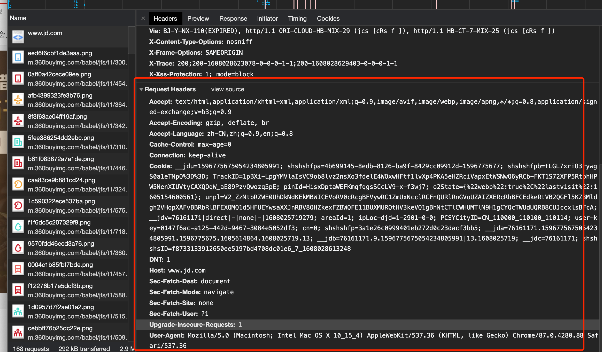


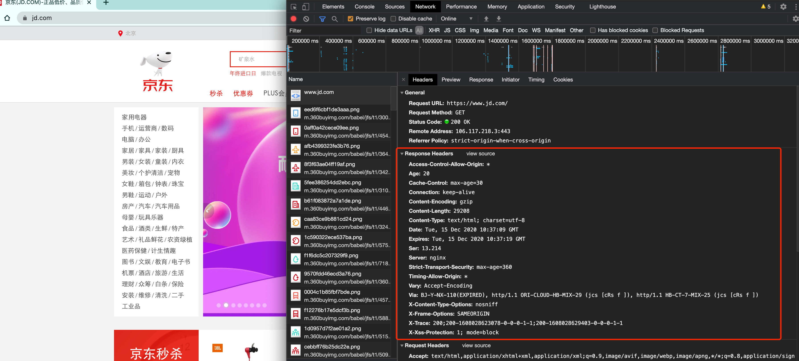


请求头中最常见的一些重要内容(爬虫需要):

1. User-Agent : 请求载体的身份标识(用啥发送的请求)
2. Referer: 防盗链(这次请求是从哪个页面来的?  反爬会用到)
3. cookie: 本地字符串数据信息(用户登录信息, 反爬的token)

响应头中一些重要的内容: 

1. cookie: 本地字符串数据信息(用户登录信息, 反爬的token)
2. 各种神奇的莫名其妙的字符串(这个需要经验了, 一般都是token字样, 防止各种攻击和反爬)

请求方式: 

​	GET:   显示提交

​	POST:  隐示提交

## requests模块入门(重点)

在前面小节中, 我们使用urllib来抓取页面源代码. 这个是python内置的一个模块. 但是, 它并不是我们常用的爬虫工具. 常用的抓取页面的模块通常使用一个第三方模块requests. 这个模块的优势就是比urllib还要简单, 并且处理各种请求都比较方便. 

既然是第三方模块, 那就需要我们对该模块进行安装, 安装方法:

```python
pip install requests
```

如果安装速度慢的话可以改用国内的源进行下载安装. 

```python
pip install -i https://pypi.tuna.tsinghua.edu.cn/simple requests
```

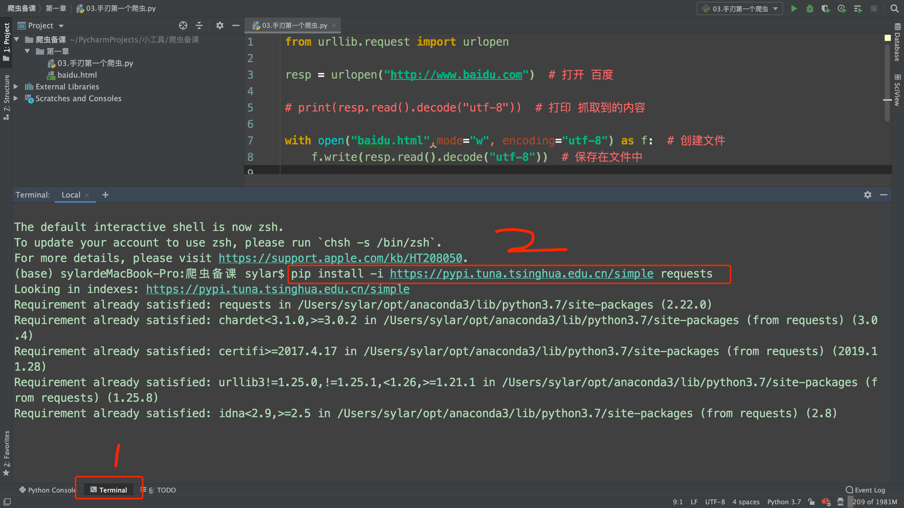

OK. 接下来我们来看看requests能带给我们什么?

先拿sogou开刀试试. 

```python
# 案例1. 抓取搜狗搜索内容
kw = input("请输入你要搜索的内容:")
response = requests.get(f"https://www.sogou.com/web?query={kw}")  # 发送get请求
# print(response.text)  # 直接拿结果(文本)

with open("sogou.html", mode="w", encoding="utf-8") as f:
    f.write(response.text)
```

接下来, 我们看一个稍微复杂那么一丢丢的, 百度翻译~

`注意百度翻译这个url不好弄出来. 记住, 在输入的时候, 关掉各种输入法, 要用英文输入法, 然后不要回车. 就能看到这个sug了`

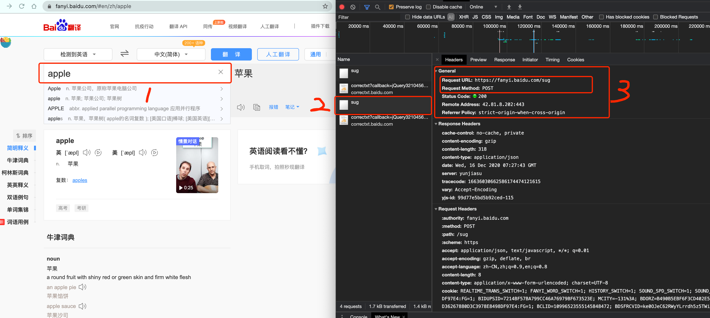

```python
# 案例2.抓取百度翻译数据
import requests
# 准备参数
kw = input("请输入你要翻译的英语单词:")
dic = {
    "kw": kw  # 这里要和抓包工具里的参数一致.
}
# 请注意百度翻译的sug这个url. 它是通过post方式进行提交的. 所以我们也要模拟post请求
resp = requests.post("https://fanyi.baidu.com/sug", data=dic)

# 返回值是json 那就可以直接解析成json
resp_json = resp.json()
# {'errno': 0, 'data': [{'k': 'Apple', 'v': 'n. 苹果公司，原称苹果电脑公司'....
print(resp_json['data'][0]['v'])  # 拿到返回字典中的内容

```

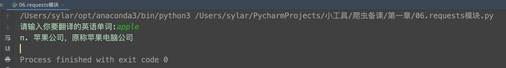

是不是很顺手呢?  还有一些网站在进行请求的时候会校验你的客户端设备型号. 比如, 我们抓取豆瓣电影

```python
# 案例3: 抓取豆瓣电影
url = 'https://movie.douban.com/j/chart/top_list'
param = {
    'type': '24',
    'interval_id': '100:90',
    'action':'',
    'start': '0',#从库中的第几部电影去取
    'limit': '20',#一次取出的个数
}
headers = {
    'User-Agent': 'Mozilla/5.0 (Macintosh; Intel Mac OS X 10_12_0) AppleWebKit/537.36 (KHTML, like Gecko) Chrome/72.0.3626.121 Safari/537.36'

}
response = requests.get(url=url,params=param,headers=headers)
list_data = response.json()

fp = open('./douban.json','w',encoding='utf-8')
json.dump(list_data,fp=fp,ensure_ascii=False)
print('over!!!')
```

下载一张图片有多容易?

```python
import requests

url = "https://img2.doubanio.com/view/photo/s_ratio_poster/public/p2578474613.jpg"
resp = requests.get(url)
file_name = url.split("/")[-1]
with open(file_name, mode="wb") as f:
    f.write(resp.content)  # resp.content得到的是bytes(字节)
```

关于requests总结:

1. `requests.get()`  发送get请求,  请求参数可以直接放在`url`的`?`后面, 也可以放在字典里, 传递给`params`. 
2. `requests.post()` 发送post请求, 请求参数要放在`字典`里, 传递给`data`
3. `resp.text`  接收`文本`, 本质就是把`resp.content`进行`decode()`的结果.
4. `resp.json()` 接收`resp.json()`
5. `resp.content` 接收`字节`


