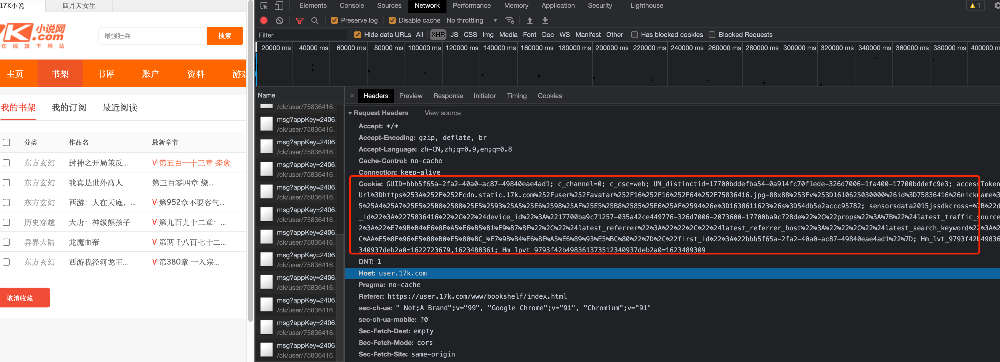
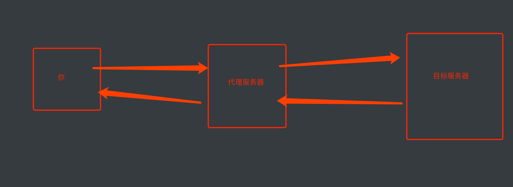

# 关于请求头


## 一. Cookie

首先, cookie就是保存在客户端(浏览器)上的一个字符串. 在每次发送请求时, 浏览器会自动的带上cookie的信息传递给服务器. 

尤其在用户登录后, 为了能准确的获取到用户登录信息. cookie一般都会在请求是跟随请求头一起提交到服务器. 




接下来, 直接上案例吧,  抓取自己收藏到书架上的小说信息

如果是临时需要, 我们还可以直接从浏览器复制cookie出来直接丢到headers里

```python
resp = requests.get("https://user.17k.com/ck/author/shelf?page=1&appKey=2406394919", headers={
    "Cookie":"GUID=bbb5f65a-2fa2-40a0-ac87-49840eae4ad1; c_channel=0; c_csc=web; UM_distinctid=17700bddefba54-0a914fc70f1ede-326d7006-1fa400-17700bddefc9e3; Hm_lvt_9793f42b498361373512340937deb2a0=1614327827; accessToken=avatarUrl%3Dhttps%253A%252F%252Fcdn.static.17k.com%252Fuser%252Favatar%252F16%252F16%252F64%252F75836416.jpg-88x88%253Fv%253D1610625030000%26id%3D75836416%26nickname%3D%25E9%25BA%25BB%25E8%25BE%25A3%25E5%2587%25A0%25E4%25B8%259D%26e%3D1629888002%26s%3D63b8b7687fc8a717; sensorsdata2015jssdkcross=%7B%22distinct_id%22%3A%2275836416%22%2C%22%24device_id%22%3A%2217700ba9c71257-035a42ce449776-326d7006-2073600-17700ba9c728de%22%2C%22props%22%3A%7B%22%24latest_traffic_source_type%22%3A%22%E7%9B%B4%E6%8E%A5%E6%B5%81%E9%87%8F%22%2C%22%24latest_referrer%22%3A%22%22%2C%22%24latest_referrer_host%22%3A%22%22%2C%22%24latest_search_keyword%22%3A%22%E6%9C%AA%E5%8F%96%E5%88%B0%E5%80%BC_%E7%9B%B4%E6%8E%A5%E6%89%93%E5%BC%80%22%7D%2C%22first_id%22%3A%22bbb5f65a-2fa2-40a0-ac87-49840eae4ad1%22%7D; Hm_lpvt_9793f42b498361373512340937deb2a0=1614336271"
})
print(resp.text)

```


如果真的需要登录的话, 可以用session来保持会话. 

session是个什么东西. 我们不用管服务器那边的session. 我们只关心爬虫里`requests`模块提供的`session`. 
在`requests`模块中提供了session这个功能. 它能保持会话过程, 听着听绕嘴. 但其实就是它能自动帮我们管理和维护cookie. <span style="color:red;background:yellow;">但请注意, 它能自动维护的只能是响应头返回的cookie. `js`动态添加的cookie. 它可管不了.</span> 

```python
import requests

# 建立session
session = requests.session()
# 准备用户名密码
data = {
    "loginName": "16538989670",
    "password": "xxxxxx"
}
# UA
headers = {
    "user-agent":"Mozilla/5.0 (Macintosh; Intel Mac OS X 10_15_4) AppleWebKit/537.36 (KHTML, like Gecko) Chrome/87.0.4280.141 Safari/537.36"
}
# 登录后, 服务器会返回set-cookie. 这种直接返回的cookie会被session自动处理
resp = session.post("https://passport.17k.com/ck/user/login", data=data, headers=headers)
# 可以看一眼cookie中的东西
print(session.cookies)
# 带着cookie请求书架
resp = session.get("https://user.17k.com/ck/author/shelf")
print(resp.text)

```

综上, 我们可以用session来保持会话. 后面我们遇到一些需要保持会话过程的请求时就可以使用session来完成. 


## 二. 防盗链

抓取梨视频视频数据

```python
import requests

url = "https://www.pearvideo.com/video_1713901"
contId = url.split("_")[1]
print(contId)
videoStatus_url = f"https://www.pearvideo.com/videoStatus.jsp?contId={contId}&mrd=0.8770894467476524"
headers = {
    "User-Agent": "Mozilla/5.0 (Macintosh; Intel Mac OS X 10_15_4) AppleWebKit/537.36 (KHTML, like Gecko) Chrome/87.0.4280.141 Safari/537.36",
    "Referer": url  # 防盗链,意义:本次请求是由哪个url产生的
resp = requests.get(videoStatus_url, headers=headers)
dic = resp.json()
# print(dic)
systemTime = dic['systemTime']
videoUrl = dic["videoInfo"]['videos']['srcUrl']
videoUrl = videoUrl.replace(systemTime, "cont-"+contId)  # 拼接真正的视频url地址
# print(videoUrl)

# 下载视频
with open(f"{contId}.mp4", mode="wb") as f:
    f.write(requests.get(videoUrl).content)
```


## 三. 代理

当我们反复抓取一个网站时, 由于请求过于频繁, 服务器很可能会将你的IP进行封锁来反爬. 应对方案就是通过网络代理的形式进行伪装. 

代理的原理:



从图上可以得知. 对于目标网站来说. 是通过代理服务器发送的请求. 也就可以避免你的IP被封锁了. 

爬虫如何使用代理

樵夫下午测试的. 

http://www.kxdaili.com/dailiip/2/1.html  低概率能用

https://ip.jiangxianli.com/ 低概率能用

```python
import requests

headers = {
    "User-Agent": "Mozilla/5.0 (Macintosh; Intel Mac OS X 10_15_4) AppleWebKit/537.36 (KHTML, like Gecko) Chrome/87.0.4280.141 Safari/537.36",
}
proxies = {
    "http": "http://223.96.90.216:8085"
}

resp = requests.get("http://www.baidu.com/s?ie=UTF-8&wd=ip", headers=headers, proxies=proxies)
resp.encoding="utf-8"
print(resp.text)

```

注意: 代理IP一般属于一个灰色产业. 在本课程中不做深入讨论. 代理IP也是时能用,时不能用. 各为观众姥爷要自己想办法了~ 
