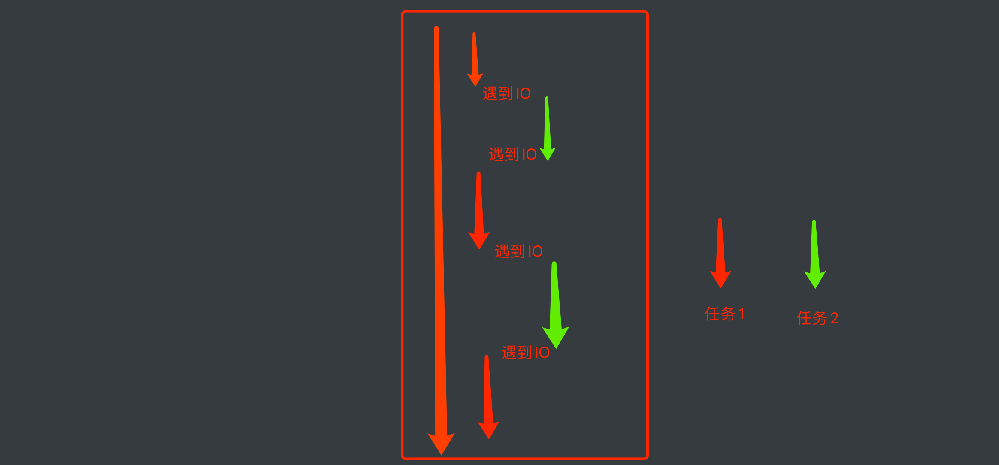

# 多任务异步协程

## 一, Python协程基础知识

### 1.1 协程概念引入

​		协程是我要重点去讲解的一个知识点. 它能够更加高效的利用CPU. 

​		其实, 我们能够高效的利用多线程来完成爬虫其实已经很6了. 但是, 从某种角度讲, 线程的执行效率真的就无敌了么? 我们真的充分的利用CPU资源了么? 非也~ 比如, 我们来看下面这个例子. 

我们单独的用一个线程来完成某一个操作. 看看它的效率是否真的能把CPU完全利用起来. 

```python
import time

def func():
    print("我爱黎明")
    time.sleep(3)
    print("我真的爱黎明")
   
func()
```

​		各位请看. 在该程序中, 我们的func()实际在执行的时候至少需要3秒的时间来完成操作. 中间的三秒钟需要让我当前的线程处于阻塞状态. 阻塞状态的线程 CPU是不会来执行你的.  那么此时cpu很可能会切换到其他程序上去执行. 此时, 对于你来说, CPU其实并没有为你工作(在这三秒内), 那么我们能不能通过某种手段, 让CPU一直为我而工作. 尽量的不要去管其他人. 

​		我们要知道CPU一般抛开执行周期不谈, 如果一个线程遇到了IO操作, CPU就会自动的切换到其他线程进行执行. 那么, 如果我想办法让我的线程遇到了IO操作就挂起, 留下的都是运算操作. 那CPU是不是就会长时间的来照顾我~. 

​		以此为目的, 伟大的程序员就发明了一个新的执行过程. 当线程中遇到了IO操作的时候,  将线程中的任务进行切换, 切换到其他任务. 等原来的IO执行完了. 再恢复回原来的任务中. 



就形成了这样一种模型, 在程序遇到了IO操作(费时不费力的操作)时, 自动切换到其他任务. 该模型被称为协程. 


### 1.2 协程基本语法

协程的基本写法: 咱就介绍一种, 也是最好用的一种.

先上手来一下. 

````python
async def func():
    print("我是协程")


if __name__ == '__main__':
    # print(func())  # 注意, 此时拿到的是一个协程对象, 和生成器差不多.该函数默认是不会这样执行的

    coroutine = func()
    asyncio.run(coroutine)  # 用asyncio的run来执行协程.
    # lop = asyncio.get_event_loop()
    # lop.run_until_complete(coroutine)   # 这两句顶上面一句
    
````

效果不明显, 继续加码

```python
import time
import asyncio

# await: 当该任务被挂起后, CPU会自动切换到其他任务中
async def func1():
    print("func1, start")
    await asyncio.sleep(3)
    print("func1, end")


async def func2():
    print("func2, start")
    await asyncio.sleep(4)
    print("func2, end")


async def func3():
    print("func3, start")
    await asyncio.sleep(2)
    print("func3, end")


async def run():
    start = time.time()
    tasks = [  # 协程任务列表
        asyncio.ensure_future(func1()),  # 创建协程任务
        asyncio.ensure_future(func2()),
        asyncio.ensure_future(func3()),
    ]
    await asyncio.wait(tasks)  # 等待所有任务执行结束
    print(time.time() - start)

if __name__ == '__main__':
    asyncio.run(run())
```


模拟一下爬虫怎么样~

```python
import asyncio

async def download(url):
    print("开始抓取")
    await asyncio.sleep(3)  # 我要开始下载了
    print("下载结束", url)
    return "老子是源码你信么"


async def main():
    urls = [
        "http://www.baidu.com",
        "http://www.h.com",
        "http://luoyonghao.com"
    ]
    # 生成任务列表
    tasks = []
    for url in urls:
        tasks.append(asyncio.create_task(download(url)))
    done, pedding = await asyncio.wait(tasks)
    for d in done:
        print(d.result())

if __name__ == '__main__':
    asyncio.run(main())
```


### 1.3 多任务协程返回值

```python
import asyncio


async def faker1():
    print("任务1开始")
    await asyncio.sleep(1)
    print("任务1完成")
    return "任务1结束"


async def faker2():
    print("任务2开始")
    await asyncio.sleep(2)
    print("任务2完成")
    return "任务2结束"


async def faker3():
    print("任务3开始")
    await asyncio.sleep(3)
    print("任务3完成")
    return "任务3结束"


async def main():
    tasks = [
        asyncio.create_task(faker3()),
        asyncio.create_task(faker1()),
        asyncio.create_task(faker2()),
    ]
    # 方案一, 用wait, 返回的结果在result中
    result, pending = await asyncio.wait(tasks)
    for r in result:
        print(r.result())
        
    # 方案二, 用gather, 返回的结果在result中, 结果会按照任务添加的顺序来返回数据
    # 	return_exceptions如果任务在执行过程中报错了. 返回错误信息. 
    result = await asyncio.gather(*tasks, return_exceptions=True)
    for r in result:
        print(r)


if __name__ == '__main__':
    asyncio.run(main())

```


## 二, 协程在爬虫中的使用

aiohttp是python的一个非常优秀的第三方异步http请求库. 我们可以用aiohttp来编写异步爬虫(协程)

安装:

```python
pip install aiohttp
pip install aiofiles
```


### 2.1 aiohttp模块基本使用

实例代码:

```python
import aiohttp
import asyncio
import aiofiles


async def download(url):
    try:
        name = url.split("/")[-1]
        # 创建session对象 -> 相当于requsts对象
        async with aiohttp.ClientSession() as session:
            # 发送请求, 这里和requests.get()几乎没区别, 除了代理换成了proxy
            async with session.get(url) as resp:
                # # resp.text(encoding='') 这可以设置字符集 
                # 读取数据. 如果想要读取源代码. 直接resp.text()即可. 比原来多了个()
                content = await resp.content.read()
                # 写入文件, 用默认的open也OK. 用aiofiles能进一步提升效率
                async with aiofiles.open(name, mode="wb") as f:
                    await f.write(content)
                    return "OK"
    except:
        print(123)
        return "NO"


async def main():
    url_list = [
        "https://x.u5w.cc/Uploadfile/202110/20/42214426253.jpg",
        "https://x.u5w.cc/Uploadfile/202110/20/B3214426373.jpg",
        "https://www.xiurenji.vip/uploadfile/202110/20/1F214426892.jpg",
        "https://www.xiurenji.vip/uploadfile/202110/20/91214426753.jpg"
    ]
    tasks = []

    for url in url_list:
        # 创建任务
        task = asyncio.create_task(download(url))
        tasks.append(task)

    await asyncio.wait(tasks)


if __name__ == '__main__':
    asyncio.run(main())

```

从最终运行的结果中能非常直观的看到用异步IO完成爬虫的效率明显高了很多


### 2.2 协程案例-扒光一部小说需要多久?

目标, 明朝那些事儿 http://www.mingchaonaxieshier.com/

```python
import asyncio
import aiohttp
import aiofiles
import requests
from lxml import etree
import os


def get_chapter_info(url):
    resp = requests.get(url)
    resp.encoding = 'utf-8'
    page_source = resp.text
    resp.close()

    result = []

    # 解析page_soruce
    tree = etree.HTML(page_source)
    mulus = tree.xpath("//div[@class='main']/div[@class='bg']/div[@class='mulu']")
    for mulu in mulus:
        trs = mulu.xpath("./center/table/tr")
        title = trs[0].xpath(".//text()")
        chapter_name = "".join(title).strip()

        chapter_hrefs = []
        for tr in trs[1:]:  # 循环内容
            hrefs = tr.xpath("./td/a/@href")
            chapter_hrefs.extend(hrefs)

        result.append(
            {"chapter_name": chapter_name, "chapter_hrefs": chapter_hrefs}
        )

    return result


async def download_one(name, href):
    async with aiohttp.ClientSession() as session:
        async with session.get(href) as resp:
            hm = await resp.text(encoding="utf-8", errors="ignore")
            # 处理hm
            tree = etree.HTML(hm)
            title = tree.xpath("//div[@class='main']/h1/text()")[0].strip()
            content_list = tree.xpath("//div[@class='main']/div[@class='content']/p/text()")
            content = "\n".join(content_list).strip()
            async with aiofiles.open(f"{name}/{title}.txt", mode="w", encoding="utf-8") as f:
                await f.write(content)

    print(title)

# 方案一
async def download_chapter(chapter):
    chapter_name = chapter['chapter_name']

    if not os.path.exists(chapter_name):
        os.makedirs(chapter_name)
    tasks = []
    for href in chapter['chapter_hrefs']:
        tasks.append(asyncio.create_task(download_one(chapter_name, href)))
    await asyncio.wait(tasks)


# 方案二
async def download_all(chapter_info):
    tasks = []
    for chapter in chapter_info:
        name = chapter['chapter_name']
        if not os.path.exists(name):
            os.makedirs(name)
        for url in chapter['chapter_hrefs']:
            task = asyncio.create_task(download_one(name, url))
            tasks.append(task)

    await asyncio.wait(tasks)


def main():
    url = "http://www.mingchaonaxieshier.com/"
    # 获取每一篇文章的名称和url地址
    chapter_info = get_chapter_info(url)

    # 可以分开写. 也可以合起来写.
    # 方案一，分开写:
    # for chapter in chapter_info:
    #     asyncio.run(download_chapter(chapter))

    # 方案e，合起来下载:
    asyncio.run(download_all(chapter_info))


if __name__ == '__main__':
    main()

```
