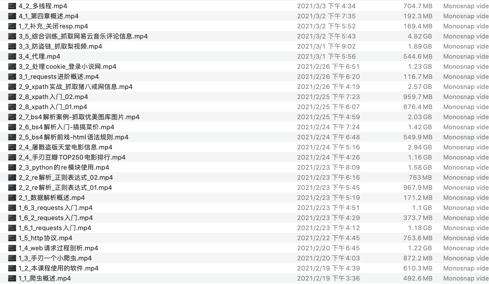
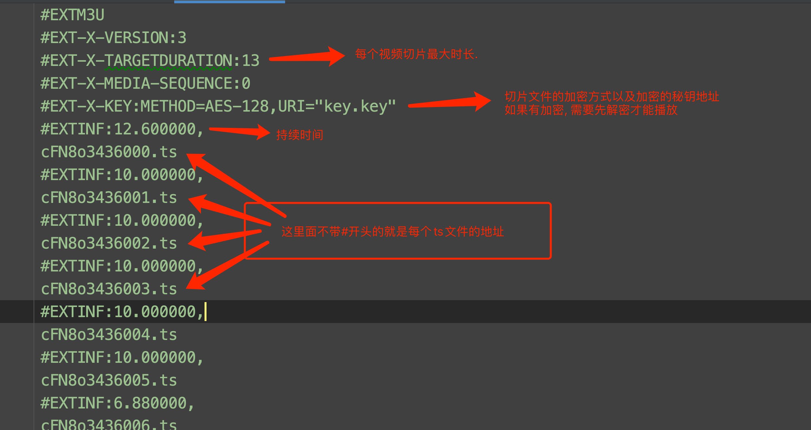
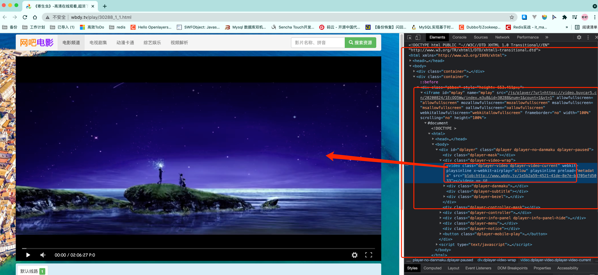
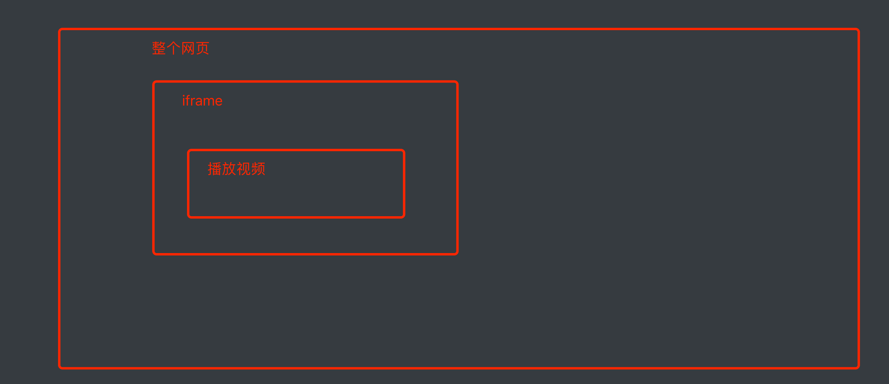
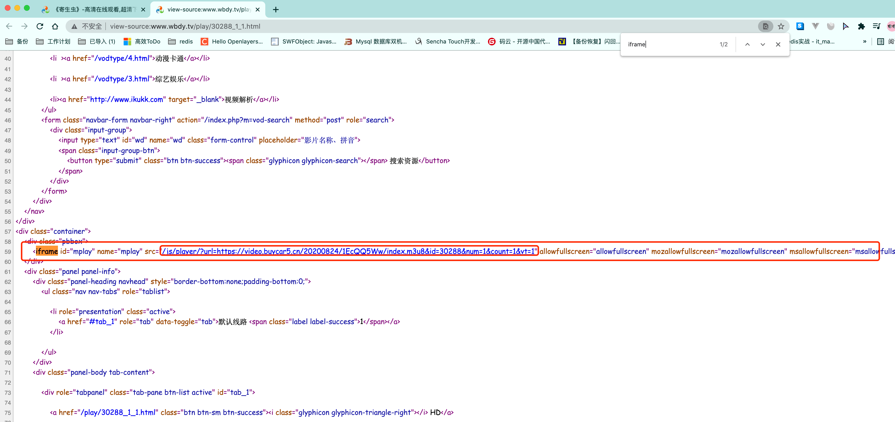
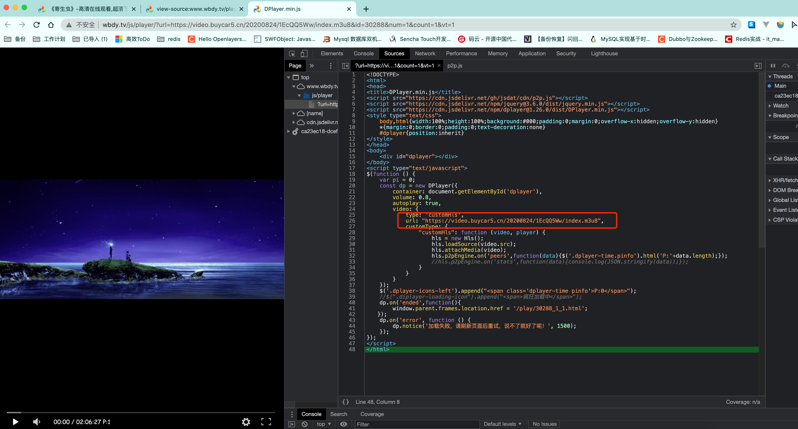
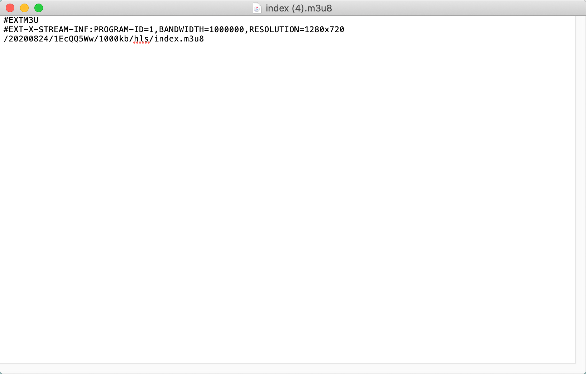

# 利用异步协程抓取一部电影

我们把目光转向wbdy. 目前该案例还是可以用的. 

我们想要抓取网上的视频资源就必须要了解我们的视频网站是如何工作的. 这里我用91看剧来做举例. 其他网站的原理是一样的. 

## 1.视频网站是如何工作的

假设, 你现在想要做一个视频网站. 也有很多的UP猪帮你上传视频. OK, 作为服务器作者的你. 只需要把视频保存起来. 然后给出一个视频的链接即可. 然后在你的HTML代码中通过`video`标签引入即可. 



```html
<video src="1_1_爬虫概述.mp4"></video>
```

就可以了. 但是, 如果你这么做. 你的用户和老板一定会把你骂的狗血临头. 为什么呢?

假设你的视频是10个G的高清无码大资源. 那么此时, 你的用户和你老板将面临如下困境

1. 用户: 这个视频怎么加载的这么慢. 点击快进也快进不了. 太慢了. 塔喵的烦死了. 
2. 老板: 怎么这个月的流量费又这么高啊. 要死的拉好不~

为什么会这样? 聪明的我告诉你答案.  你的视频那么大. 每次用户打开的时候. 可能只是差了最后几分钟没看呢. 那此时它必须把整个视频都传输完毕. 才能看到他想看的那里. 等待时间肯定超长的好不.  而每次都要把10G的文件进行网络传输. 流量费~你懂的. 三大运营商最喜欢的就是你这种朴实无华的送钱行为. 

OK~ 不扯了. 但凡有点儿经验的程序员肯定会想办法把用户上传好的视频进行转码(不同清晰度)做切片(ts)处理. 这样既方便用户进行大跨度的调整进度条(最小延迟). 也能为公司节省大量的流量费. 

既然要把视频切成非常多个小碎片. 那就需要有个文件来记录这些小碎片的路径. 该文件一般为M3U文件. M3U文件中的内容经过UTF-8的编码后, 就是M3U8文件. 今天, 我们看到的各大视频网站平台使用的几乎都是M3U8文件. 

如何解读M3U8文件. 



基本知道这些就够了. 

## 2. 网吧电影网站分析

​		接下来, 我们以网吧电影这个网站中<寄生虫>http://www.wbdy.tv/play/30288_1_1.html作为目标, 先分析一下该网站的视频是如何播放的. 

### 2.1 找到M3U8文件



从图上我们能发现播放视频的video标签是被嵌套在一个叫iframe标签内部的. 而iframe是当前页面中被嵌入的一个小窗口.  嵌套规则如下: 



iframe实际上是HTML语言中的一个标签, 它可以将另一个网页的内容嵌入进来. 也就是说. iframe里面其实是另一个html页面. 

OK, 接下来, 我们去页面源代码中看一看(一定要去页面源代码里看. 不要再F12的elements里看!!!!!!!!!!)



我们发现, 当前网页的页面源代码中是有iframe标签的. 里面的src对应的是另一个url网址. 我们可以点击一下这个网址.


从图上可以看到, 我们之前推到的结构是没问题的. 我们想要看到的视频播放确实放在了这个iframe对应的url里面. 

然后我们再去看看这个iframe里的页面源代码.  注意, 这个页面被视频播放器给填满了. 所以必须去F12的source里看. 



至此, 我们终于找到了该电影所对应的M3U8文件地址了. 

先做一个小总结,  针对网吧电影这个网站而言, 我们想要得到M3U8文件, 过程是: 

1. 访问视频主页的页面源代码. 提取到iframe中的src属性. 暂时记做iframe_url 
2. 提取iframe_url的页面源代码. 提取到M3U8文件的地址

> 注意, 有些网站不是这样的结构, 所以该逻辑未必适用于所有视频网站. 不过一般的网站都大同小异, 只要盯着M3U8即可


### 2.2 M3U8文件解析

我们把刚才的M3U8文件的url地址https://video.buycar5.cn/20200824/1EcQQ5Ww/index.m3u8拿出来. 丢到浏览器里. 会自动开始下载m3u8文件

用记事本打开它, 



里面前两行内容不用管. 第三行里存放的是另一个M3U8文件的地址. 依然是一个url. 我们把这个url和第一次拿到的那个url整合在一起. 继续丢浏览器下载. 


简单解读一下. 前面的内容, 只有EXT-X-KEY有用.  这里面的METHOD=AES-128表示该视频是经过加密的. 需要进行解密. 解密的秘钥存放在URI对应的网址内. 

后面就简单多了. 每一个不以#开头的, 都是视频切片ts文件. 

后期解析起来的整体思路也就出来了. 

1. 下载每一个ts文件

2. 获取到秘钥key

3. 使用AES对ts文件进行解密. 

4. 将众多ts文件合并为MP4文件. 

    

## 3. 代码

```python
# <video src="http://www.baidu.com/苍井空.mp4"></video>
# 不论是用户体验. 还是公司流量费的压力. 上面方案是不行的
# 一般的视频网站都会做以下操作:
# 1. 把视频进行备份.
# 2. 对视频进行转码
# 3. 对视频进行切片. 3-5s 之间, 视频的顺序又很难保障.
# 4. 把切片顺序保存在一个文件中(M3U)文件.一般M3U文件编码成utf-8进行存储. m3u8文件, M3U8里面有每个切片的名字和正确的播放顺序
# 5. 用户进行播放是一个视频的时候. 通常先加载这个M3U8文件.
# 6. 从M3U8中读取到ts文件的名称和地址. 然后按照M3U8文件的顺序进行播放


# 如果有了M3U8  这个视频就可以进行下载了(盗版视频)

"""
过程:
    上半场:
        1. 访问主页面http://www.wbdy.tv/play/30288_1_1.html得到iframe的地址
        2. 从iframe的地址中. 获取到第一层M3U8的地址
        3. 下载第一层M3U8并解析出第二层M3U8的地址, 下载第二层M3U8文件
        4. 读取第二层M3U8的文件. 下载每一个TS文件
    下半场:
        1. 拿到秘钥
        2. 用这个秘钥去解密所有ts文件
        3. 根据M3U8的顺序把ts文件合并起来.
"""
import requests
from lxml import etree
from urllib.parse import urljoin
import re
import asyncio
import aiohttp
import aiofiles
from Crypto.Cipher import AES  # 需要安装, PCrypto. pip install pycryptodome
import os


def get_iframe_src(url):
    resp = requests.get(url)
    resp.encoding = 'utf-8'
    page_source = resp.text
    resp.close()

    tree = etree.HTML(page_source)
    iframe_url = tree.xpath("//iframe/@src")
    if iframe_url:
        iframe_url = iframe_url[0]
    else:
        iframe_url = ""
    return iframe_url


def get_first_m3u8_url(iframe_url):
    resp = requests.get(iframe_url)
    # 尝试打印有没有乱码  如果没有. 就这么招
    resp.encoding='utf-8'
    page_source = resp.text
    resp.close()
    # 如果你想要从一段js里面拿到东西. 最好的方案就是RE
    obj = re.compile(r'url: "(?P<m3u8_url>.*?)",', re.S)
    result = obj.search(page_source)
    m3u8_url = result.group("m3u8_url")
    return m3u8_url


def download_m3u8_file(m3u8_url):
    resp1 = requests.get(m3u8_url)

    with open("第一层M3U8.txt", mode="wb") as f:
        f.write(resp1.content)
    resp1.close()

    # 读取第一层M3U8的文件. 下载第二层M3U8的文件
    with open("第一层M3U8.txt", mode="r", encoding="utf-8") as f:
        for line in f:
            if line.startswith("#"):
                continue
            else:
                # 一定要处理
                line = line.strip()  # 去掉无关的\n和空白
                # /20200824/1EcQQ5Ww/1000kb/hls/index.m3u8
                second_m3u8_url = urljoin(m3u8_url, line)
                # 下载第二层M3U8文件
                resp2 = requests.get(second_m3u8_url)
                with open("第二层m3u8.txt", mode="wb") as f:
                    f.write(resp2.content)
                    print("第二次M3U8地址下载成功!!")


async def download_one(ts_url, session, sem):
    async with sem:  # 这里也是异步
        for i in range(5):  # 单个文件重新下载
            try:  # 自省.
                # 发送请求出去
                async with session.get(ts_url) as resp:
                    content = await resp.content.read()
                    # 存储到文件中
                    file_name = ts_url.split("/")[-1]
                    async with aiofiles.open(f"video_1/{file_name}", mode="wb") as f:
                        await f.write(content)
                    print(ts_url, "下载成功!")
                    break
            except Exception as e:
                print(e)
                print(ts_url, "下载失败")


async def download_all_ts():
    # windows的同学. 注意. 如果, 你的电脑运行的时候. 会产生一些奇怪的bug(*访问量过高.....)
    # 需要添加一个叫信号量的东西. 来控制并发量.
    sem = asyncio.Semaphore(200)  # 我的测试中. 网吧电影中有些电影必须要控制在3或5以下, 限制访问频率不是这个错误(Server disconnected)
    tasks = []
    # 1.读取M3U8文件. 拿到每一个ts的下载地址
    async with aiohttp.ClientSession() as session:  # 用1个session搞定所有请求
        with open("第二层m3u8.txt", mode="r", encoding='utf-8') as f:
            for line in f:
                if line.startswith("#"):
                    continue
                line = line.strip()  # 非常重要
                # https://ts1.yuyuangewh.com:9999/20200824/1EcQQ5Ww/1000kb/hls/o996I0bz.ts
                t = asyncio.create_task(download_one(line, session, sem))
                tasks.append(t)
        await asyncio.wait(tasks)


def get_key():
    obj = re.compile(r'#EXT-X-KEY:METHOD=AES-128,URI="(?P<key_url>.*?)"', re.S)

    with open("第二层m3u8.txt", mode='r', encoding="utf-8") as f:
        for line in f:
            result = obj.search(line)
            if result:   # 如果能search到东西才可以提取.
                key_url = result.group('key_url')
                resp = requests.get(key_url)
                key_content = resp.content  # 这个地方直接拿出字节就可以了. 为了和后面好对接
                resp.close()
                return key_content


async def desc_one_ts(file_name, key):
    # 解密的过程
    # 加密或者解密器
    aes = AES.new(key=key, mode=AES.MODE_CBC, IV=b"0000000000000000")
    async with aiofiles.open(f"./video_2/{file_name}", mode='rb') as f1,\
        aiofiles.open(f"./video_3/{file_name}", mode='wb') as f2:
        # 读取ts文件的内容
        content = await f1.read()
        desc_content = aes.decrypt(content)  # 解密
        await f2.write(desc_content)
    print(file_name, "解密成功!")


async def desc_all_ts(key):
    tasks = []
    # 读取每一个ts文件的名字. 然后. 单独的解密该文件即可
    with open("第二层m3u8.txt", mode="r", encoding='utf-8') as f:
        for line in f:
            if line.startswith("#"):
                continue
            line = line.strip()
            file_name = line.split("/")[-1]
            t = asyncio.create_task(desc_one_ts(file_name, key))  # 去解密
            tasks.append(t)
    await asyncio.wait(tasks)


def merge():
    print("记载m3u8......")
    file_list = []
    with open("第二层m3u8.txt", mode='r', encoding='utf-8') as f:
        for line in f:
            if line.startswith("#"):
                continue
            line = line.strip()
            file_name = line.split("/")[-1]  # 获取到文件的名称
            file_list.append(file_name)

    print("记载m3u8, 成功......")
    print(file_list)

    # 文件的合并;
    # mac, linux电脑   cat  1.ts 2.ts 3.ts > xxx.ts
    # windows  copy /b 1.ts+2.ts+3.ts xxx.ts
    # python中想要执行命令行的命令. 需要用到os模块中的system(命令)或者popen(命令)
    # os.system("dir")  # windows那头99.99% 出乱码
    # r = os.popen("dir")  # windows的兄弟用这个.
    # print(r.read()) # 这个不乱码

    # 如果一次性全部合并. 那么命令行会提示; 命令太长
    # 分段进行合并
    # 如果我在当前文件夹下进行合并的话.
    # 先切换目录到video_3里面去. 然后进行合并. 合并后. 再切换出来

    # 切换工作目录
    os.chdir("./video_3")
    temp = []
    n = 1  # 合并的次数
    for i in range(len(file_list)):
        file_name = file_list[i]
        temp.append(file_name)  # [1.ts, 2.ts, 3.ts]
        # if i % 50 ==0 and i != 0:
        if len(temp) == 50:
            # 合并一批ts文件
            cmd = f"cat {' '.join(temp)} > {n}.ts"
            r = os.popen(cmd)
            print(r.read())
            # 归零
            temp = []
            n += 1

    # 如果最后还剩下xxx个, 把剩余的再次合并一次
    # 合并一批ts文件
    cmd = f"cat {' '.join(temp)} > {n}.ts"
    r = os.popen(cmd)
    print(r.read())
    n += 1  # 这里为什么n+=1

    # 第二次大合并
    second_temp = []
    for i in range(1, n):
        second_temp.append(f"{i}.ts")

    cmd = f"cat {' '.join(second_temp)} > mm.mp4"
    r = os.popen(cmd)
    print(r.read())

    os.chdir("../")  # 结束后记着切换回来


def main():
    # url = "http://www.wbdy.tv/play/30288_1_1.html"
    # iframe_url = get_iframe_src(url)
    # # print(iframe_url)
    # # 完善iframe的src的地址
    # iframe_url = urljoin(url, iframe_url)
    # first_m3u8_url = get_first_m3u8_url(iframe_url)
    # download_m3u8_file(first_m3u8_url)

    # 下载所有的ts文件(协程)
    # asyncio.run(download_all_ts())

    # # 获取秘钥
    # key = get_key()
    #
    # # 解密
    # asyncio.run(desc_all_ts(key))

    # 合并ts文件(纯逻辑)
    merge()


if __name__ == '__main__':
    main()

```


