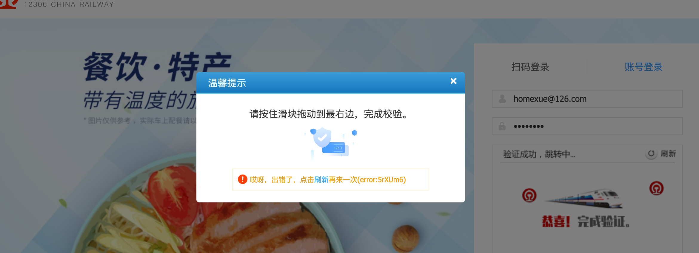

# selenium小进阶+案例

## 关于验证码

验证码处理: 

	1. 直接把浏览器里面的cookie拿出来直接用. 
	2. 手动编写验证码识别的功能(深度学习)
	3. 第三方打码平台(收费), 超级鹰, 图鉴

上一节, 我们聊过关于验证码的问题. 本节继续. 

图鉴-好东西http://www.ttshitu.com/


这个东西. 既便宜. 有好用. 比超级鹰爽. 

注册个账号. 如果不想注册. 直接用我的也OK

然后就可以用了. 

官方示例:

```python
import base64
import json
import requests
# 一、图片文字类型(默认 3 数英混合)：
# 1 : 纯数字
# 1001：纯数字2
# 2 : 纯英文
# 1002：纯英文2
# 3 : 数英混合
# 1003：数英混合2
#  4 : 闪动GIF
# 7 : 无感学习(独家)
# 11 : 计算题
# 1005:  快速计算题
# 16 : 汉字
# 32 : 通用文字识别(证件、单据)
# 66:  问答题
# 49 :recaptcha图片识别 参考 https://shimo.im/docs/RPGcTpxdVgkkdQdY
# 二、图片旋转角度类型：
# 29 :  旋转类型
#
# 三、图片坐标点选类型：
# 19 :  1个坐标
# 20 :  3个坐标
# 21 :  3 ~ 5个坐标
# 22 :  5 ~ 8个坐标
# 27 :  1 ~ 4个坐标
# 48 : 轨迹类型
#
# 四、缺口识别
# 18 : 缺口识别（需要2张图 一张目标图一张缺口图）
# 33 : 单缺口识别（返回X轴坐标 只需要1张图）
# 五、拼图识别
# 53：拼图识别
def base64_api(uname, pwd, img, typeid):
    with open(img, 'rb') as f:
        base64_data = base64.b64encode(f.read())
        b64 = base64_data.decode()
    data = {"username": uname, "password": pwd, "typeid": typeid, "image": b64}
    result = json.loads(requests.post("http://api.ttshitu.com/predict", json=data).text)
    if result['success']:
        return result["data"]["result"]
    else:
        return result["message"]


if __name__ == "__main__":
    img_path = "xxxx.jpg"
    result = base64_api(uname='q6035945', pwd='q6035945', img=img_path, typeid=3)
    print(result)
```

非常的简单. 

老规矩. 我要用图鉴干图鉴, selenium那个上节课讲过了. 这节课我们讲requests

```python
def base64_api(uname, pwd, b64_img, typeid):
    data = {"username": uname, "password": pwd, "typeid": typeid, "image": b64_img}
    result = json.loads(requests.post("http://api.ttshitu.com/predict", json=data).text)
    if result['success']:
        return result["data"]["result"]
    else:
        return result["message"]


def login():
    session = requests.session()
    url = "http://www.ttshitu.com/login.html?spm=null"
    resp = session.get(url)
    tree = etree.HTML(resp.text)

    # 先处理验证码
    # captchaImg
    data_href = tree.xpath("//img[@id='captchaImg']/@data-href")[0]

    resp = session.get(data_href)

    js = resp.json()
    result = base64_api("q6035945","q6035945", js['img'], '1003')

    data = {
        "captcha": result,
        "developerFlag": False,
        "imgId": js['imgId'],
        "needCheck": True,
        "password": "q6035945",
        "userName": "q6035945",
    }

    headers={
        'Content-Type': 'application/json; charset=UTF-8',
        'User-Agent': 'Mozilla/5.0 (Macintosh; Intel Mac OS X 10_15_4) AppleWebKit/537.36 (KHTML, like Gecko) Chrome/91.0.4472.114 Safari/537.36',
    }
    print(data)
    login_url = "http://admin.ttshitu.com/common/api/login/user"
    resp = session.post(login_url, data=json.dumps(data), headers=headers)
    print(resp.text)


if __name__ == '__main__':
    login()

```


## 关于等待

在selenium中有三种等待方案

1. time.sleep()

    这个没啥说的. 就是干等.  不论元素是否加载出来. 都要等

2. web.implicitly_wait(10)

    这个比上面那个人性化很多. 如果元素加载出来了. 就继续. 如果没加载出来. 此时会等待一段时间. 

    注意, 此设置是全局设置.  一次设置后. 后面的加载过程都按照这个来. (爬虫用的会多一些)

3. WebDriverWait

    这个比较狠. 单独等一个xxxx元素. 如果出现了. 就过, 如果不出现. 超时后, 直接报错. 

    ```python
    ele = WebDriverWait(web, 10, 0.5).until(
            EC.presence_of_element_located((By.XPATH, "/html/body/div[5]/div[2]/div[1]/div/div"))
        )
    ```


## Selenium搞定bilibili登录

我们用Selenium来模拟一下bilibili的登录过程(点选,  如果是滑块。干不过去。). 

```PYTHON
from selenium.webdriver import Chrome
from selenium.webdriver.common.by import By

from selenium.webdriver.common.action_chains import ActionChains

import time
import base64
import requests
import json

def base64_api(uname, pwd, img, typeid):
    with open(img, 'rb') as f:
        base64_data = base64.b64encode(f.read())
        b64 = base64_data.decode()
    data = {"username": uname, "password": pwd, "typeid": typeid, "image": b64}
    result = json.loads(requests.post("http://api.ttshitu.com/predict", json=data).text)
    if result['success']:
        return result["data"]["result"]
    else:
        return result["message"]


web = Chrome()
web.get("https://www.bilibili.com/")

web.maximize_window()
web.implicitly_wait(10)

web.find_element(By.XPATH, "//*[@class='header-login-entry']").click()

web.find_element(By.XPATH, "//*[@class='bili-mini-account']/input").send_keys("13300001111")
web.find_element(By.XPATH, "//*[@class='bili-mini-password']/div/input").send_keys("123456789")
time.sleep(2)
web.find_element(By.XPATH, "//*[@class='universal-btn login-btn']").click()
time.sleep(2)
tu = web.find_element(By.XPATH, "//*[@class='geetest_holder geetest_silver']")
tu.screenshot("tu.jpg")

result = base64_api("q6035945", "q6035945", "tu.jpg", 27)
print(result)
rs = result.split("|")
for r in rs:
    x, y = r.split(",")
    x = int(x)
    y = int(y)

    ac = ActionChains(web)
    ac.move_to_element_with_offset(tu, xoffset=x, yoffset=y)
    ac.click()
    ac.perform()
    time.sleep(1)

time.sleep(3)
web.find_element(By.XPATH, "//*[@class='geetest_commit_tip']").click()

```


## Selenium可以获取到Elements的结构代码

```python
import time

from selenium.webdriver import Chrome
from selenium.webdriver.common.by import By
from lxml import etree

def get_page_source(url):
    web.get(url)
    web.find_element(By.XPATH, "//*[@class='video-list row']")
    time.sleep(3)
    page_source = web.page_source  # 获取page_source, 也就是elements中的代码
    return page_source


if __name__ == '__main__':
    web = Chrome()
    web.implicitly_wait(10)  # 设置一个等待
    for i in range(1, 6):
        page = i
        o = page * 36
        url = f"https://search.bilibili.com/all?keyword=%E5%87%A4%E5%87%B0%E8%8A%B1%E5%BC%80%E7%9A%84%E8%B7%AF%E5%8F%A3&from_source=webtop_search&spm_id_from=333.1007?page={page}&o={o}"
        ps = get_page_source(url)

        tree = etree.HTML(ps)
        txt = tree.xpath('//*[@class="video-list row"]//text()')  # 自行细化就好
        print(txt)
        print(f"======={url}============================")
        time.sleep(1)
```


## 利用selenium登录12306

12306网站已经改版. 没有了以前烦人的验证码. 此时登录非常顺滑. 

在最后一步, 进入滑块环节, 这里其实看似容易, 操作起来就恶心了. 因为这里才是本节真正要讲的. 12306会在这里进行浏览器验证, 验证你是否是通过自动化工具启动的浏览器. 而且, 这个问题非常恶心, 常规的浏览器检测处理方案都是没用的. 



注意, 此时我们要了解一下这个插件的工作机制. 它是在整个页面加载的时候就开始对浏览器参数进行读取. 所以我们常规的对Chrome设置是无效的. 此时, 需要添加以下一段代码来规避检测. 

```python
# 亲测, 88版本以后可以用.
option = Options()
# option.add_experimental_option('excludeSwitches', ['enable-automation'])
option.add_argument('--disable-blink-features=AutomationControlled')
web = Chrome(options=option)

# 亲测, 88版本之前可以用.
# web = Chrome()
#
# web.execute_cdp_cmd("Page.addScriptToEvaluateOnNewDocument", {
#   "source": """
#   navigator.webdriver = undefined
#     Object.defineProperty(navigator, 'webdriver', {
#       get: () => undefined
#     })
#   """
# })
```


最后给出完整代码

```python
from selenium.webdriver import Chrome
from selenium.webdriver.support.ui import WebDriverWait  # 等待
from selenium.webdriver.common.by import By
from selenium.webdriver.support import expected_conditions as EC
from selenium.webdriver.common.action_chains import ActionChains
from selenium.webdriver.chrome.options import Options

opt = Options()
# 处理 检测webdriver
opt.add_argument('--disable-blink-features=AutomationControlled')

web = Chrome(options=opt)

web.get("https://kyfw.12306.cn/otn/resources/login.html")
web.implicitly_wait(10)
web.find_element(By.XPATH, '//*[@id="toolbar_Div"]/div[2]/div[2]/ul/li[1]/a').click()

web.find_element(By.XPATH, '//*[@id="J-userName"]').send_keys("hehehe@126.com")
web.find_element(By.XPATH, '//*[@id="J-password"]').send_keys("111111")

web.find_element(By.XPATH, '//*[@id="J-login"]').click()


# 滑动
# 找到滑块
btn = web.find_element(By.XPATH, '//*[@id="nc_1_n1z"]')
ActionChains(web).click_and_hold(btn).move_by_offset(0, 300).perform()

```


总结, selenium的使用方案一般是: 

1. 涉及登录. 验证码不想搞. 

    可以考虑用selenium完成登录. 然后提取cookie. 最后用requests发送真正的请求. 

2. 涉及频繁的校验验证(例如boss).

    直接用selenium提取页面源代码. 叫给lxml处理. 
    
    

## cookie的小问题

### 获取cookie

我们用17k.com来做实验. 

```python
from selenium.webdriver import Chrome
from selenium.webdriver.chrome.options import Options
from selenium.webdriver.common.by import By
import time
import json


web = Chrome()
web.get('https://www.17k.com/')
web.implicitly_wait(10)

# 登录
web.find_element(By.XPATH, '//*[@id="header_login_user"]/a[1]').click()

# 切换iframe
iframe = web.find_element(By.XPATH, '//div[@class="QUI_POP_CONT"]/iframe')
web.switch_to.frame(iframe)

web.find_element(By.XPATH, '/html/body/form/dl/dd[2]/input').send_keys("18614075987")
web.find_element(By.XPATH, '/html/body/form/dl/dd[3]/input').send_keys("q6035945")

web.find_element(By.XPATH, '/html/body/form/dl/dd[5]/input').click()

time.sleep(3)

cookies = web.get_cookies()

# 存文件里
with open("cookies.txt", mode="w", encoding='utf-8') as f:
    f.write(json.dumps(cookies))


# 组装cookie字典, 直接给requests用
dic = {}
for cook in cookies:
    dic[cook['name']] = cook['value']

# 衔接. 把cookie直接怼进去
import requests

url = "https://user.17k.com/ck/author/shelf?page=1&appKey=2406394919"
resp = requests.get(url, cookies=dic)
print(resp.text)

```


### 设置cookie

```python
web.get('https://www.17k.com/')  # 打开
with open("cookies.txt", mode="r", encoding='utf-8') as f:
    cookies = json.loads(f.read())

    for cook in cookies:
        web.add_cookie(cook)

web.get('https://www.17k.com/')  # 打开
```


