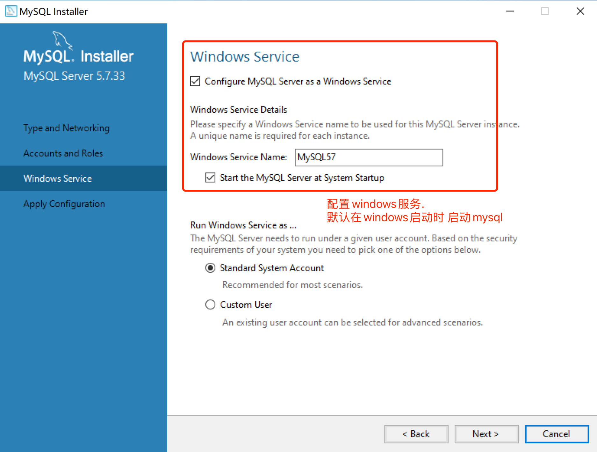

# MySQL数据库存储


## 一. MySQL数据库简介

​	    数据库是一个能存数据的软件, 提供各种数据的查询操作, 以及对数据的修改操作

​		数据库, 是我们存储数据最常用的一种软件. 在之前的案例中, 我们都是把数据存储在文件里的. 这样存储的好处是比较方便. 简单. 但是这样存储数据的弊端也非常明显. 数据提取的时候相当繁琐. 尤其在存储了大量数据集后. 想提取一个人的名字可能都是非常困难的. 此时, 数据库就体现了它的用处. 

​		数据库的本质就是一个能存储数据的软件. 我们把数据交给数据库后, 数据库会按照它自己的规则将数据存储在文件中. 区别于我们直接存储在文件里. 它的这种存储会非常的方便我们对数据进行提取和处理. 在今天的互联网如此发达的时代. 数据库已经是每一款软件作为数据持久化存储的必选方案.  

​		数据库又分为关系型(SQL)和非关系型数据库(NoSQL, MongoDB, Redis), 我们这节只聊关系型数据库. 

​		常见的关系型数据库, 

​				MySQL, MSSQL(学校), Oracle(甲骨文),等等.....

​		总之, 目前市场上最认可的就是MySQL.所以我们学MySQL


## 二. MySQL开发环境

### 2.1  MySQL安装

安装不上的同学可以使用樵夫提供的阿里云MySQL, 自己装一个Navicat即可. 

```
IP地址: 101.200.161.187
端口: 3306
账号: root
密码: root
```

请各位不要删除别人创建好的数据库以及数据

建议自己创建一个属于自己的数据库在里面. 互相不冲突. 


先去mysql官网下载好安装包. (https://dev.mysql.com/downloads/)

樵夫会在网盘里. 给你安装包





接下来是MySQL的图形化界面工具.  推荐用Navicat. 好多年了, 很好用. 安装的时候一路确定. 


### 2.2 Navicat使用


哦了, 至此, Navicat可以操纵你的数据库了. 


## 三. 表的操作

### 3.1 表的概念

在所有关系型数据库中, 所有的数据都是以表格的形式进行存储的. 那表格应该如何进行设计呢? 其实这里蕴含了一个映射关系的. 

比如, 我们想要存学生信息. 那我们先思考. 在你未来的规划中, 一个学生应该会有哪些数据存在? 

学生: 学号(唯一标识), 姓名, 生日, 家庭住址, 电话号等信息. OK. 我们抛开数据库不谈. 想要存储这些数据, 表格创建起来的话应该是是这样的:


OK. 按照这个规则来看. 每一条数据对应的就是一个人的信息. 

### 3.2 创建表

创建表有两种方案: 

1. 用SQL语句创建表格

    ```sql
    create table student(
        -- 字段=列=column=属性
    	sno int(10) primary key auto_increment,
        sname varchar(50) not null, 
        sbirthday date not null,
        saddress varchar(255),
        sphone varchar(12),
        class_name varchar(50)
    );
    ```

    数据类型:

    ​	int 整数

    ​	double小数 

    ​	varchar  字符串

    ​	date  时间(年月日)

    ​	datetime 时间(年月日时分秒)

    ​	text 大文本

    ​	

    约束条件:

    ​	primary key 主键, 全表唯一值. 就像学号. 身份证号. 能够唯一的确定一条数据

    ​	auto_increment 主键自增. 必须是整数类型

    ​	not null  不可以为空.

    ​	null  可以为空

    ​	default 设置默认值

    

    ​		

2. 用Navicat图形化工具来创建

    

    

    

    

### 3.3 修改表

 1. SQL方式(了解)

    ```python 
    -- 添加一列
    ALTER TABLE table_name
    ADD COLUMN column_name datatype
    
    -- 删除一列
    ALTER TABLE table_name 
    DROP COLUMN column_name
    
    -- 修改一列的数据类型
    ALTER TABLE table_name
    MODIFY COLUMN column_name datatype
    
    -- 表格重命名
    ALTER TABLE table_name RENAME TO new_name;
    
    ```

    

 2. Navicat方式

    

    

## 四. 数据的操作-增删改查-数据(重点)

### 	4.1 增加数据

```sql
INSERT INTO table_name(col1, col2, col3...) values (val1,val2,val3)
```

```sql
-- 添加学生信息
INSERT INTO STUDENT(sname, sbirthday, saddress, sage, class_name) values ('周杰伦', '2020-01-02', "北京市昌平区", 18, "二班");
```

注意, 如果主键设置自增, 就不用处理主键了. mysql会自动的帮我们按照自然顺序进行逐一自增.

### 4.2 删除数据

```sql
DELETE FROM table_name where_clause
```

```sql
-- 删除学生信息
DELETE FROM STUDENT where sno = 1 ; 
```

### 4.3 修改数据

```sql
UPDATE table_name SET col1 = val1, col2 = val2... where_clause
```

```sql
-- 修改学生信息
UPDATE STUDENT SET SNAME = '王力宏' where sno = 1;
```


注意, 修改和删除数据的时候一定要带上where条件, 否则全表更新(删除). 小白一定要小心!!!!!

### 4.4 查询数据

#### 4.4.1 基础查询

```sql
SELECT *|col1, col2, col3 
FROM table_name 
where_clause
```

```sql
-- 全表查询
SELECT * FROM STUDENT;

-- 查询学生姓名, 年龄
SELECT sname, sage FROM STUDENT;

-- 查询学号是1的学生信息
select * from student where sno = 1;

-- 查询年龄大于20的学生信息
select * from student where sage > 20;

-- 查询学生年龄大于20 小于40的信息(包含)
select * from student where sage >= 20 and sage <= 40;
select * from student where sage between 20 and 40 ;

-- 查询姓张的学生信息
-- 		_一位字符串
-- 		%多位字符串
select * from student where sname like '张%';
```


#### 4.4.2 分组查询和聚合函数

如何查询每个班级学生的平均年龄? 

我们先把数据扩充一下下


每个班级的平均年龄. 我们是不是需要先把班级与班级先分开.  每个班级自己内部进行计算.对吧. 此时, 我们需要的就是一个分组的操作. 此时需要用到group by语句

```sql
select * from table_name group by col_name
```

注意, 上方的sql是无法使用的.  sql要求分组后, 到底要做什么必须明确指出. 否则报错

那很容易呀, 我们分完组要计算每个班级的平均年龄. 平均数如何计算, 这就要用到聚合函数. sql中提供5种聚合函数, 分别是: avg(), sum(), min(), max(), count()

```sql
-- 查询每一个班级的平均年龄
select avg(sage), class_name from STUDENT group by class_name;

-- 查询每个班级最小的年龄
select min(sage), class_name from STUDENT group by class_name;

-- 查询每个班的最大年龄
select max(sage), class_name from STUDENT group by class_name;

-- 查询每个班的学生数量
select count(*), class_name from STUDENT group by class_name;

-- 查询每个班级的年龄和
select sum(sage), class_name from STUDENT group by class_name;
```

注意, 不要把没有放在group by的内容直接放在select中. 你想想. 按照班级来查询平均年龄, 你非要把某一个人的信息放在结果里. 是不合适的. 


#### 4.4.4 having语句

如果我们需要对聚合函数计算的结果进一步的筛选. 可以用having语句

```sql
-- 查询平均年龄在15岁以上的班级信息
select avg(sage), class_name from student group by class_name having avg(sage) > 15;
```

having和where的区别:

 1. where, 在原始数据上进行的数据筛选. 

 2. having, 在聚合函数计算后的结果进行筛选. 

    

#### 4.4.5 排序

sql中使用order by语句对查询结果进行排序. 

```sql
-- 按照年龄从小到大查询学生信息
select * from student order by sage asc

-- 按照年龄从大到小查询学生信息
select * from student order by sage desc
```


### 4.5 多表联合查询(课上不讲)

==(从这里开始后面内容想了解就了解, 不想了解直接过. )==

在实际使用中, 一个表格肯定是无法满足我们数据存储的. 比如, 在学生选课系统中. 我们就可以设计成以下表结构:

1. 学生表: 学号, 姓名, 性别, 住址等...
2. 课程表: 课程编号, 课程名称, 授课教师等...
3. 学生课程-成绩表:  成绩表编号, 学号, 课程编号, 成绩

在这样的表结构中:

​	优势: 每个表的结构相对明确. 不存在歧义.  数据保存完整, 没有冗余. 
​	劣势: 新手不太好想. 想不通为什么要这样设计. 这里涉及到数据库表结构设计范式, 该模型属于第三范式(听过就行).

在该模型表结构中. 成绩表是非常重要的.  在成绩表中, 明确的说明了哪个学生的哪一门课程得了多少分. 它将两个原来毫不相关的表关联了起来. 建立了主外键关系.  

何为主外键关系: 

​		把A表中的主键放在另一张表里作为普通字段使用,  但数据要求必须来自于A. 这个很好理解. 比如, 学生成绩表中的学生编号数据就必须来自于学生表. 否则该数据是无意义的. 

注意, 以上结构只是为了讲解多表关系. 并非完整的学生选课系统表结构. 

建表语句:

```sql
-- 创建学生表, 课程表, 成绩表
-- 1. 学生表: 学号, 姓名, 性别, 住址等...
-- 2. 课程表: 课程编号, 课程名称, 授课教师等...
-- 3. 学生课程-成绩表:  成绩表编号, 学号, 课程编号, 成绩
create table stu(
	sid int primary key auto_increment,
	sname varchar(50) not null, 
	gender int(1),
	address varchar(255)
);

create table course(
	cid int primary key auto_increment,
	cname varchar(50) not null, 
	teacher varchar(50)
);

create table sc(
	sc_id int primary key auto_increment,
	s_id int, 
	c_id int,
	score int,
	CONSTRAINT FK_SC_STU_S_ID FOREIGN key(s_id) REFERENCES stu(sid),
	CONSTRAINT FK_SC_COURSE_C_ID FOREIGN key(c_id) REFERENCES course(cid)
);

```


#### 4.5.1 子查询

​	在where语句中可以进行另外的一个查询. 

​	例如, 查询选择了"编程"这门课的学生

```sql
-- 查询选择了"编程"这门课的学生
-- 先查询编程课程的编号
select cid from course where cname = '编程';
-- 根据cid可以去sc表查询出学生的id
select s_id from sc where c_id = 2;
-- 根据学生ID查询学生信息
select * from stu where sid in (1,2,3,4,5,6);

-- 把上面的sql穿起来 
select * from stu where sid in (
    select s_id from sc where c_id in (
        select cid from course where cname = '编程'
    )
);

-- 查询课程名称为“编程”，且分数低于60的学生姓名和分数
select stu.sname, sc.score from stu, sc where stu.sid = sc.s_id and sc.score < 60 and sc.c_id in (
	select cid from course where cname = '编程'
)

```


#### 4.5.2 关联查询

关联查询就是把多个表格通过join的方式合并在一起. 然后进行条件检索. 

语法规则:

```sql
select ... from A xxx join B on A.字段1 = b.字段2

表示:  A表和B表连接. 通过A表的字段1和b表的字段2进行连接. 通常on后面的都是主外键关系
```


##### 4.5.2.1 inner jion

```sql
-- 查询每门课程被选修的学生数
-- count(*)
-- group by cid

select c.cid,c.cname, count(*) from sc inner join course c on sc.c_id = c.cid group by c.cid, c.cname
```


##### 4.5.2.2 left join

```sql
-- 查询所有学生的选课情况
select s.sname, c.cname from stu s left join sc on s.sid= sc.s_id left join course c on sc.c_id = c.cid

-- 查询任何一门课程成绩在70分以上的姓名、课程名称和分数
-- score > 70 sc
-- sname student
-- cname course
select s.sname, c.cname, sc.score from stu s inner join sc on s.sid = sc.s_id inner join course c on sc.c_id = c.cid
where sc.score > 70
```


## 五. Python连接MySQL

python连接mysql可以用pymysql模块

```python
pip install pymysql
```

pymysql基本使用:

```python
import pymysql

# 链接数据库
conn = pymysql.connect(
    host='localhost',
    port=3306,
    user='root',
    password='test123456',
    database='spider_back'
)
# 创建游标
cursor = conn.cursor()
# 接下来就可以用游标去执行各种操作了
cur.close()  # 断开cursor
conn.close()  # 断开连接

```


### 5.1 pymysql执行增删改操作

#### 5.1.1 添加数据

```python
try:
    cursor = conn.cursor()
    result = cursor.execute("insert into stu(sname, address, gender) values ('李嘉诚', '八宝山', 1)")
    print(cursor.lastrowid)  # 获取自增的ID值
    print(result)  # result是该sql会影响多少条数据
    conn.commit()  # 提交
except:
    conn.rollback()  # 回滚
cur.close()  # 断开cursor
conn.close()  # 断开连接
```


#### 5.1.2 修改数据

```python
try:
    cursor = conn.cursor()
    result = cursor.execute("update stu set gender = 2 where sid = 12")
    print(result)  # result是该sql会影响多少条数据
    conn.commit()  # 提交
except:
    conn.rollback()  # 回滚
    
cur.close()  # 断开cursor
conn.close()  # 断开连接
```


#### 5.1.3 删除数据

```python
try:
    cursor = conn.cursor()
    result = cursor.execute("delete from stu where sid = 12")
    print(result)  # result是该sql会影响多少条数据
    conn.commit()  # 提交
except:
    conn.rollback()  # 回滚
cur.close()  # 断开cursor
conn.close()  # 断开连接
```


### 5.2 查询操作

```python
# 查询
from pymysql.cursors import DictCursor
# cursor = conn.cursor(DictCursor)  # 使用字典游标. 查询出的结果自动保存在字典中
cursor = conn.cursor()  # 默认游标. 查询出的结果自动保存在元组中

sql = """
    select * from stu
"""
ret_num = cursor.execute(sql)
# result = cursor.fetchall()  # 获取全部结果
# result = cursor.fetchmany(5)  # 获取部分结果
result = cursor.fetchone()  # 获取单个结果
print(result)
result = cursor.fetchone()  # 获取单个结果, 可以连续获取
print(result)

cur.close()  # 断开cursor
conn.close()  # 断开连接
```

注意, 一个游标如果被拿空了. 则不能再次获取内容. 


附: MySQL远程连接时, 必须对数据库做一个简短的配置

1, 打开mysql命令行. 

2, 输入以下内容

```mysql
GRANT ALL PRIVILEGES ON *.* TO '用户名'@'%' IDENTIFIED BY '密码' WITH GRANT OPTION;
FLUSH PRIVILEGES;
```


