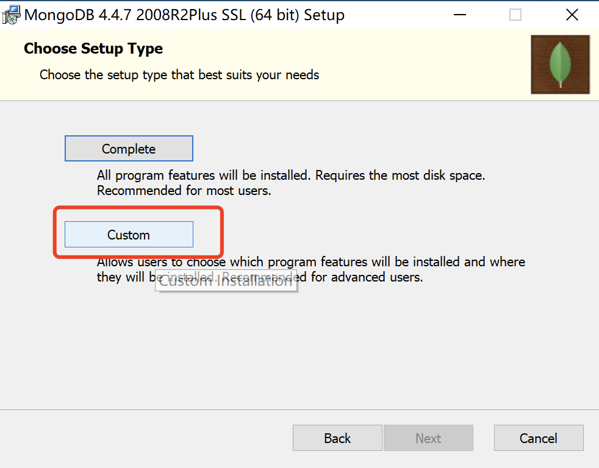
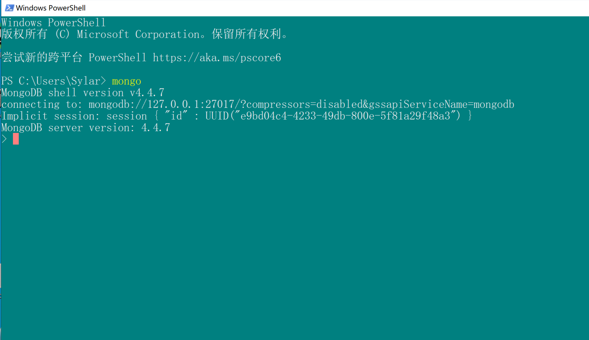

# MongoDB数据存储

MongoDB, redis是一个非关系型数据库(NoSQL). 非常适合超大数据集的存储, 通常我们爬虫工程师使用MongoDB作为数据采集的存储. 


## 一, MongoDB的安装(windows)

首先去官网下载MongoDB的安装包, https://www.mongodb.com/try/download/community





将mongodb目录下的bin文件夹添加到PATH环境变量




对于mac的安装可以使用homebrew安装.  或参考这里https://www.runoob.com/mongodb/mongodb-osx-install.html

MySQL  

数据库(database)->表格(table)->数据(data)


MongoDB

数据库(database)->集合(collection)->文档(document)


## 二, MongoDB的简单使用

简单介绍一下mongoDB中一些操作(了解)

```
db: 当前正在使用的数据库
show dbs: 显示所有数据库
show databases: 显示所有数据库
use xxxx: 调整数据库
db.dropDatabase(): 删除数据库
show collections: 显示当前数据库中所有的集合(表)
db.collection_name.insert({})
db.createCollection(name, {options}) 创建集合 	capped:是否卷动, size:大小
db.collection_name.drop()  删除集合
db.collection_name.insert()  向集合中添加数据( 如果该集合不存在, 自动创建)
db.collection_name.isCapped() 判断是否有容量上限(判断该集合是否是固定容量的集合)
```


## 三, MongoDB的增删改查

### 1. mongodb中常见的数据类型(了解):

```
Object ID: 主键ID
String: 字符串
Boolean: 布尔值  
Integer: 数字
Doube: 小数
Arrays: 数组
Object: 文档(关联其他对象)  {sname: 李嘉诚, sage: 18, class:{cccc}}
Null : 空值 
Timestamp: 时间戳
Date: 时间日期
```


### 2. mongodb添加数据

```mongo
db.collection_name.insert({字段:值,字段:值})
db.collection_name.insertOne({字段:值,字段:值})
db.collection_name.insertMany([{}, {}])
```

示例:

```mongo
db.nor_col.insert({name:"樵夫", age:18, hobby:['吃', '喝', '拉撒睡']})
db.nor_col.insertOne({name:"樵夫", "age":18, "hobby":['吃', '喝', '拉撒睡']})
db.nor_col.insertMany([{name:"樵夫", age:18, hobby:['吃', '喝', '拉撒睡']}, {name:"樵夫", age:18, hobby:['吃', '喝', '拉撒睡']}])
```

注意, 如果集合不存在. 则会自动创建集合


### 3. mongodb修改数据

#### 3.1 update更新

```mongo
db.collection_name.update({查询条件}, {待修改内容}, {multi: 是否多条数据修改, upsert:true})
```

示例:

```
db.nor_col.update({name:"樵夫"}, {$set:{title:"alex", hobby:['抽烟', '喝酒', '烫头']}}, {multi:true});
db.nor_col.update({name:"樵夫"}, {title:"alex"}) 
```

\$set和没有\$set的区别:
	\$set只会修改当前给出的字段, 其他内容保留
	没有\$set只会保留当前给出字段, 其他内容删除

mutil: 如果为True, 必须用\$set. 否则报错. 


#### 3.2 保存(save, 了解)

```
db.collection_name.save({待保存数据})
```

注意, 如果save的内容中的\_id如果存在就更新, 如果不存在就添加

```
db.nor_col.save({_id:'60fe1c75f76b22511a447852', name:"樵", age:29})
```


### 4.mongodb删除数据

#### 4.1 remove()

```
db.collection_name.remove({条件}, {justOne:true|false})
```

示例:

```
db.nor_col.remove({name:"樵夫"}, {justOne:true})
```

#### 4.2 deleteOne()

```
db.collection_name.deleteOne({条件})
```

示例:

```
db.nor_col.deleteOne({name:"樵夫"})
```

#### 4.3 deleteMany()

```
db.collection_name.deleteMany({条件})
```

示例:

```
db.nor_col.deleteMany({name:"樵夫"})
```


### 5. mongodb查询数据

准备数据: 

```
db.stu.insert([
	{name: "朱元璋", age:800, address:'安徽省凤阳', score: 160},
	{name: "朱棣", age:750, address:'江苏省南京市', score: 120},
	{name: "朱高炽", age:700, address:'北京紫禁城', score: 90},
	{name: "李嘉诚", age:38, address:'香港xxx街道', score: 70},
	{name: "麻花藤", age:28, address:'广东省xxx市', score: 80},
	{name: "大老王", age:33, address:'火星第一卫星', score: -60},
	{name: "咩咩", age:33, address:'开普勒225旁边的黑洞', score: -160}
])
```


#### 5.1 普通查询

```
db.stu.find({条件})  查询所有
db.stu.findOne({条件})  查询一个
db.stu.find().pretty()  将查询出来的结果进行格式化(好看一些)
```


#### 5.2 比较运算

```
等于： 默认是等于判断， $eq
小于：$lt （less than） <
小于等于：$lte （less than equal） <=
大于：$gt （greater than）>
大于等于：$gte   >=
不等于：$ne  !=
```

```
db.stu.find({age:28})  查询年龄是28岁的学生信息
db.stu.find({age: {$eq: 28}})  查询年龄是28岁的学生信息
db.stu.find({age: {$gt: 30}})   查询年龄大于30岁的学生
db.stu.find({age: {$lt: 30}})   查询年龄小于30岁的学生
db.stu.find({age: {$gte: 38}})  查询年龄大于等于30岁的学生
db.stu.find({age: {$lte: 38}})  查询年龄小于等于30岁的学生
db.stu.find({age: {$ne: 38}})   查询年龄不等于38的学生
```


#### 5.3 逻辑运算符

1. and
    \$and: [条件1, 条件2, 条件3....]

```
查询年龄等于33, 并且, 名字是"大老王"的学生信息
db.stu.find({$and:[{age: {$eq:33}}, {name:'大老王'}]})
```

2. or
    \$or: [条件1, 条件2, 条件3]
    
    

```
查询名字叫"李嘉诚"的, 或者, 年龄超过100岁的人
db.stu.find({$or: [{name: '李嘉诚'}, {age: {$gt: 100}}]})
```

3. nor

    \$nor: [条件1, 条件2, 条件3]

```
查询年龄不小于38岁的人, 名字还不能是朱元璋. 
db.stu.find({$nor: [{age: {$lt: 38}}, {name: "朱元璋"}]})
```

练练试试, 查询年龄 > 50岁或者分数 > 60分

#### 5.4 范围运算符

​	使用\$in， \$nin判断数据是否在某个数组内

```
db.stu.find({age: {$in:[28, 38]}})   年龄是28或者38的人
```


#### 5.5 正则表达式

​	使用$regex进行正则表达式匹配

```
db.stu.find({address: {$regex:'^北京'}})  查询地址是北京的人的信息
db.stu.find({address: /^北京/})  效果一样
```


#### 5.6 自定义查询(了解)

mongo shell 是一个js的执行环境
使用$where 写一个函数， 返回满足条件的数据

```
db.stu.find({$where: function(){return this.age > 38}})
```


#### 5.7 skip和limit

```
db.stu.find().skip(3).limit(3)	
```

跳过3个. 提取3个. 类似limit 3, 3 可以用来做分页


#### 5.8 投影

投影可以控制最终查询的结果(字段筛选)

```
db.stu.find({}, {字段:1, 字段:1})
```

需要看的字段给1就可以了. 

注意, 除了\_id外, 0, 1不能共存. 


#### 5.9 排序

sort({字段:1, 字段:-1})

1表示升序
-1表示降序

```
对查询结果排序, 先按照age升序排列, 相同项再按照score降序排列
db.stu.find().sort({age:1, score: -1})  
```


#### 5.10 统计数量

count(条件) 查询数量

```
db.stu.count({age:33})
```


## 四, MongoDB的管道

MongoDB管道可以将多个操作依次执行, 并将上一次执行的结果传递给下一个管道表达式. 

语法: (稍微有点儿恶心)

```
db.collection_name.aggregate({管道:{表达式}}, {管道:{表达式}}, {管道:{表达式}}....)
```

管道: 
	\$group , 对数据进行分组
	\$match, 对数据进行匹配
	\$project, 对数据进行修改结构, 重命名等
	\$sort, 将数据记性排序
	\$limit, 提取固定数量的数据
	\$skip, 跳过指定数量的数据

表达式:
	\$sum, 求和
	\$avg, 计算平均值
	\$min, 最小值
	\$max, 最大值
	$push, 在结果中插⼊值到⼀个数组中

案例:

```
db.stu.aggregate({$group:{_id:'$gender'}})  # 根据性别进行分组
db.stu.aggregate({$group:{_id:'$gender', cou: {$sum: 1}}})  # 统计男生和女声的数量
db.stu.aggregate({$group:{_id:'$gender', cou:{$sum:1}, avg_score:{$avg:'$score'}, max_score:{$max: '$score'}}}) # 统计男生女生数量, 平均成绩以及最高分. 
```

关于push, 我们希望得到的结果是这样的: 我想拿到分组后的人员名单, 此时就可以用\$push将名称字段整理到一个列表中

```
db.stu.aggregate({$group:{_id:'$gender', cou:{$sum:1}, avg_score:{$avg:'$score'}, max_score:{$max: '$score'}, name_list:{$push: '$name'}}})
```

效果:

```
{ "_id" : false, "cou" : 3, "avg_score" : 123.33333333333333, "max_score" : 160, "name_list" : [ "朱元璋", "朱棣", "朱高炽" ] }
{ "_id" : true, "cou" : 4, "avg_score" : -17.5, "max_score" : 80, "name_list" : [ "李嘉诚", "麻花藤", "大老王", "咩咩" ] }
```


\$match管道可以对数据进行检索, 然后可以进入其它管道

```
db.stu.aggregate({$match:{age:{$gt:33}}}, {$group:{_id:"$gender", name_list:{$push:"$name"}}})
```

\$project管道可以对管道中的数据进行投影

```
db.stu.aggregate({$match:{age:{$gt:33}}}, {$group:{_id:"$gender", count:{$sum:1}, name_list:{$push:"$name"}}}, {$project:{_id:0, name_list:1}})
```

\$sort可以对管道中的数据进行排序

```
db.stu.aggregate({$match:{age:{$gt:33}}}, {$group:{_id:"$gender", count:{$sum:1}, name_list:{$push:"$name"}}}, {$sort:{count: 1}})
```

\$limit和$skip, 可以对管道中的数据进行分页查询

```
db.stu.aggregate({$match:{age:{$gt:33}}}, {$group:{_id:"$gender", count:{$sum:1}, name_list:{$push:"$name"}}}, {$sort:{count: 1}},{$skip:1}, {$limit:1})
```

==管道这个东西, 我们会用match和group基本上就够用了.  而且, 对于爬虫而言. 上述内容已经严重超纲了...==


## 五, MongoDB的索引操作

索引可以非常明显的提高我们查询的效率.  但是要注意, 创建索引后, 对查询效率是有显著提高的. 但是对增加数据而言效率是会变低的. 

添加索引:

```mongo
db.collection_name.ensureIndex({属性:1})   # 1 正序, -1 倒叙
```

我们多加一些数据到mongodb. 分别看看加索引和不加索引的执行效率. 

```mongo
for(i = 1; i < 100000; i++) db.tt.insert({"test": 'god'+i})
```

查询:

```mongo
db.tt.find({test:'god99999'}).explain("executionStats")
```

查询效率:

"executionTimeMillis" : 64,

加索引:

```
db.tt.ensureIndex({test:1})
```

再次查询: 

"executionTimeMillis" : 0,

这个有点儿夸张了....但查询效率肯定是提高了不少.... 

查看所有索引:

```
db.collection_name.getIndexes()
```

删除索引:

```
db.collection_name.dropIndex({属性: 1})
```


索引会带来什么:

数据量上来了.  普通的遍历的方式去找东西. 就很慢了

字典中的目录, 就是索引

索引的作用: 为了快速的查询到数据结果 

索引带来的问题:  

​	过分的创建索引. 索引的维护困难

​	在增删改查数据的时候. 索引可能需要重新建立. 效率会变低


极特殊情况下. 百万级的数据要处理.

1. 停服-备用服务器(主从复制)

2. 备份

3. 撤掉索引 

4. 处理数据

5. 重新建立索引

6. 开启测试

7. 开服-备用服务器(主从复制)

   

## 六, MongoDB的权限管理

mongodb的用户权限是跟着数据库走的. 除了超级管理员外. 其他管理员只能管理自己的库. 

6.1 创建超级管理员

首先, 将数据库调整到admin库. 

```mongo 
use admin
```

然后, 创建一个root超级管理员账号

```
db.createUser({user:"用户名", pwd: "密码", roles:['root']})
db.createUser({user:"sylar", pwd: "123456", roles:['root']})
```

创建完成后. 需要退出mongodb. 然后修改配置文件: 

mac和linux:

```config
dbpath=/usr/local/mongodb
port=27017
logpath=/usr/local/var/log/mongodb/mongo.log
fork=true
logappend=true
auth=true  # 加上账户认证
```

windows:

```config

storage:
  dbPath: D:\MongoDB\Server\4.4\data
  journal:
    enabled: true

systemLog:
  destination: file
  logAppend: true
  path:  D:\MongoDB\Server\4.4\log\mongod.log

net:
  port: 27017
  bindIp: 127.0.0.1

# 注意: security要顶格, authorization要空两格, enabled前面要有个空格
security:
  authorization: enabled

```

然后, 需要重新启动mongodb的服务(linux和mac直接杀掉进程, 重新启动即可, windows去系统服务里重启MongoDB的服务).

然后重新打开mongo, 先进入admin, 登录超级管理员账号,  进入到你想要单独创建管理员的数据库. 然后创建出该数据库的管理员账号

```
> use admin
switched to db admin
> db.auth("sylar","123456")
1
> use ddd
switched to db ddd
> db.createUser({user:"ttt_admin", pwd:"123456", roles:["readWrite"]})
```

 退出管理员账号, 重新登录刚刚创建好的账号

```
> use ddd
switched to db ddd
> db.auth("ttt_admin", "123456")
1
> db.stu.insert({name: 123, age:3})
WriteResult({ "nInserted" : 1 })
>
```

==注意, 每个账号只能管理自己的数据库(可以是多个).== 


## 七,  pymongo的使用

python处理mongodb首选就是pymongo. 首先, 安装一下这个模块

````
pip install pymongo
````

建立连接

```python
import pymongo

conn = pymongo.MongoClient(host='localhost', port=27017)
# 切换数据库
py = conn['python']
# 登录该数据库(需要的话)
py.authenticate("python_admin", '123456')
# 简单来个查询
result = py["stu"].find()
for r in result:
    print(r)
```

完成增删改查

```python
import pymongo
from pymongo import MongoClient


def get_db(database, user, pwd):
    client = MongoClient(host="localhost", port=27017)
    db = client[database]
    # 有账号就加上验证, 没有账号就不用验证
    db.authenticate(user, pwd)
    return db


# 增删改查
# 增加数据
def add_one(table, data):
    db = get_db("python", "python_admin", "123456")
    result = db[table].insert_one(data)
    return result


def add_many(table, data_list):
    db = get_db("python", "python_admin", "123456")
    result = db[table].insert_many(data_list)
    return result.inserted_ids


def upd(table, condition, data):
    db = get_db("python", "python_admin", "123456")
    data = {'hehe': 'hehe', 'meme': 'meme'}
    # result = db[table].update_many(condition, {"$set": data})
    result = db[table].update_many(condition, {'$set':data})
    return result


def delete(table, condition):
    db = get_db("python", "python_admin", "123456")
    result = db[table].remove(condition)
    return result


if __name__ == '__main__':
    # r = add_one("stu", {"name": "西瓜", "age":18})
    # print(r.inserted_id)
    # r = add_many("stu", [{"name": "嘎嘎"},{"name": "咔咔"}])
    # print(r.inserted_ids)

    # result = upd("stu", {"name": 99999}, {"age": 100})
    # print(result)

    result = delete("stu", {"name": "哈哈"})
    print(result)

```


抓链家!!!

```python
import requests
from lxml import etree
import mongodb
from concurrent.futures import ThreadPoolExecutor


def get_page_source(url):
    resp = requests.get(url)
    page_source = resp.text
    return page_source


def parse_html(html):
    tree = etree.HTML(html)
    # print(html)
    li_list = tree.xpath("//ul[@class='sellListContent']/li")
    print("==>", len(li_list))
    try:
        lst = []
        for li in li_list:
            title = li.xpath("./div[1]/div[1]/a/text()")[0]
            position_info = "-".join((s.strip() for s in li.xpath("./div[1]/div[2]/div/a/text()")))

            temp = li.xpath("./div[1]/div[3]/div/text()")[0].split(" | ")
            # 凑出来的数据. 可能会不对
            if len(temp) == 6:
                temp.insert(5, "")
            elif len(temp) == 8:
                temp.pop()
            huxing, mianji, chaoxiang, zhangxiu, louceng, nianfen, jiegou = temp
            guanzhu, fabushijian = li.xpath("./div[1]/div[4]/text()")[0].split(" / ")
            tags = li.xpath("./div[1]/div[5]/span/text()")

            data = {
                "title": title,
                "position": position_info,
                "huxing": huxing,
                "mianji": mianji,
                "chaoxiang": chaoxiang,
                "zhangxiu": zhangxiu,
                "louceng": louceng,
                "nianfen": nianfen,
                "jiegou": jiegou,
                "guanzhu": guanzhu,
                "fabushijian": fabushijian,
                "tags": tags
            }
            lst.append(data)
        # 一起存入mongodb
        print(f"数据量", len(lst))
        result = mongodb.add_many("ershoufang", lst)
        print(f"插入{len(result)}")
    except Exception as e:
        print(e)
        print(temp)

def main(url):
    page_source = get_page_source(url)
    parse_html(page_source)


if __name__ == '__main__':
    with ThreadPoolExecutor(10) as t:
        for i in range(1, 10):
            url = f"https://bj.lianjia.com/ershoufang/pg{i}/"
            t.submit(main, url)


```

