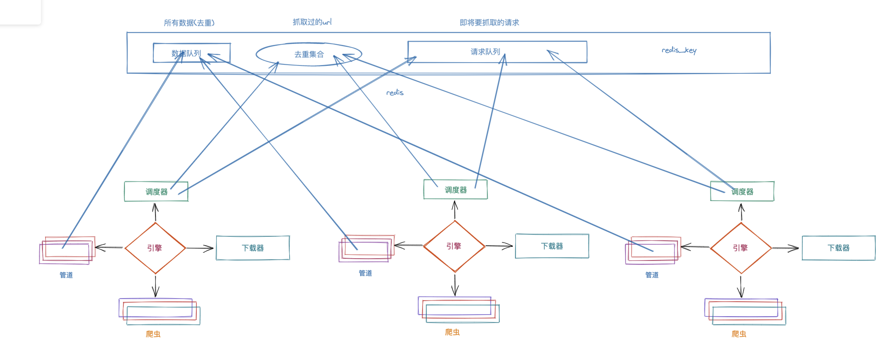

# 分布式爬虫


## 一. 增量式爬虫

​		增量式爬虫, 顾名思义. 可以对网站进行反复抓取. 然后发现新东西了就保存起来. 遇到了以前抓取过的内容就自动过滤掉即可. 其核心思想就两个字. 去重. 并且可以反复去重. 今天运行一下. 明天再运行一下. 将不同的数据过滤出来. 相同的数据去除掉(不保存)即可. 

​		此时, 我们以天涯为目标来尝试一下完成增量式爬虫. 

​		增量爬虫的核心：去除重复， 

  		1. 去除url的重复
  		2. 去除数据的重复

调度器带去除重复的。 用的是集合， python的集合


spider: 

```python
import scrapy
from redis import Redis
from tianya.items import TianyaItem


class TySpider(scrapy.Spider):

    name = 'ty'
    allowed_domains = ['tianya.cn']
    start_urls = ['http://bbs.tianya.cn/list-worldlook-1.shtml']

    def __init__(self, name=None, **kwargs):
        self.red = Redis(password="123456", db=6, decode_responses=True)
        super().__init__(name, **kwargs)

    def parse(self, resp, **kwargs):
        tbodys = resp.css(".tab-bbs-list tbody")[1:]
        for tbody in tbodys:
            hrefs = tbody.xpath("./tr/td[1]/a/@href").extract()
            for h in hrefs:
                # 两个方案.
                url = resp.urljoin(h)
                # 判断是否在该set集合中有数据
                r = self.red.sismember("tianya:details", url)  
                #   1. url去重. 优点: 简单, 缺点: 如果有人回复了帖子.就无法提取到最新的数据了
                if not r:
                    yield scrapy.Request(url=resp.urljoin(h), callback=self.parse_details)
                else:
                    print(f"该url已经被抓取过{url}")

        next_href = resp.xpath("//div[@class='short-pages-2 clearfix']/div[@class='links']/a[last()]/@href").extract_first()
        yield scrapy.Request(url=resp.urljoin(next_href), callback=self.parse)

    def parse_details(self, resp, **kwargs):
        title = resp.xpath('//*[@id="post_head"]/h1/span[1]/span/text()').extract_first()
        content = resp.xpath('//*[@id="bd"]/div[4]/div[1]/div/div[2]/div[1]/text()').extract_first()
        item = TianyaItem()
        item['title'] = title
        item['content'] = content
        # 提取完数据. 该url进入redis
        self.red.sadd("tianya:details", resp.url)  
        return item

```

​	pipelines

```python
# Define your item pipelines here
#
# Don't forget to add your pipeline to the ITEM_PIPELINES setting
# See: https://docs.scrapy.org/en/latest/topics/item-pipeline.html


# useful for handling different item types with a single interface
from itemadapter import ItemAdapter
from redis import Redis
import json

class TianyaPipeline:

    def process_item(self, item, spider):
        #   2. 数据内容去重. 优点: 保证数据的一致性. 缺点: 需要每次都把数据从网页中提取出来
        print(json.dumps(dict(item)))
        r = self.red.sadd("tianya:pipelines:items", json.dumps(dict(item)))
        if r:
            # 进入数据库
            print("存入数据库", item['title'])
        else:
            print("已经在数据里了", item['title'])
        return item

    def open_spider(self, spider):
        self.red = Redis(password="123456", db=6)

    def close_spider(self, spider):
        self.red.close()

```

上述方案是直接用redis进行的去重. 我们还可以选择使用数据库, mongodb进行过滤. 原理都一样, 不在赘述. 


## 二. 分布式爬虫

​		分布式爬虫, 就是搭建一个分布式的集群, 让其对一组资源进行分布联合爬取. 

​		既然要集群来抓取. 意味着会有好几个爬虫同时运行. 那此时就非常容易产生这样一个问题. 如果有重复的url怎么办?  在原来的程序中. scrapy中会由调度器来自动完成这个任务. 但是, 此时是多个爬虫一起跑. 而我们又知道不同的机器之间是不能直接共享调度器的. 怎么办? 我们可以采用redis来作为各个爬虫的调度器. 此时我们引出一个新的模块叫scrapy-redis. 在该模块中提供了这样一组操作. 它们重写了scrapy中的调度器. 并将调度队列和去除重复的逻辑全部引入到了redis中. 这样就形成了这样一组结构



​	整体工作流程:

	1. 某个爬虫从redis_key获取到起始url. 传递给引擎, 到调度器. 然后把起始url直接丢到redis的请求队列里. 开始了scrapy的爬虫抓取工作.  
	2. 如果抓取过程中产生了新的请求. 不论是哪个节点产生的, 最终都会到redis的去重集合中进行判定是否抓取过. 
	3. 如果抓取过. 直接就放弃该请求. 如果没有抓取过. 自动丢到redis请求队列中. 
	4. 调度器继续从redis请求队列里获取要进行抓取的请求. 完成爬虫后续的工作. 

接下来. 我们用scrapy-redis完成上述流程

1. 首先, 创建项目, 和以前一样, 该怎么创建还怎么创建. 

2. 修改Spider. 将start_urls注释掉. 更换成redis_key

3. 然后再settings中对redis以及scrapy_redis配置一下

    ```python
    REDIS_HOST = "127.0.0.1"
    REDIS_PORT = 6379
    REDIS_DB = 8
    REDIS_PARAMS = {
        "password":"123456"
    }
    
    # scrapy-redis配置信息  # 固定的
    SCHEDULER = "scrapy_redis.scheduler.Scheduler"
    SCHEDULER_PERSIST = True  # 如果为真. 在关闭时自动保存请求信息, 如果为假, 则不保存请求信息
    DUPEFILTER_CLASS = "scrapy_redis.dupefilter.RFPDupeFilter" # 去重的逻辑. 要用redis的
    ITEM_PIPELINES = {
       'tianya2.pipelines.Tianya2Pipeline': 300,
        'scrapy_redis.pipelines.RedisPipeline': 301  # 配置redis的pipeline
    }
    
    ```

布隆过滤器:

​	平时, 我们如果需要对数据进行去重操作可以有以下方案: 

	1. 直接用set集合来存储url. (最low的方案)
	2. 用set集合存储hash过的url. scrapy默认
	3. 用redis来存储hash过的请求, scrapy-redis默认就是这样做的. 如果请求非常非常多. redis压力是很大的.
	4. 用布隆过滤器. 

布隆过滤器的原理: 其实它里面就是一个改良版的bitmap. 何为bitmap, 假设我提前准备好一个数组, 然后把源数据经过hash计算. 会计算出一个数字. 我们按照下标来找到该下标对应的位置. 然后设置成1. 

```python
a = 李嘉诚
b = 张翠山
....

[0],[0],[0],[0],[0],[0],[0],[0],[0]  10个长度数组

hash(a) => 3
hash(b) => 4

[0],[0],[0],[1],[1],[0],[0],[0],[0] 
# 我想找'张三'
hash('张三') => 6

# 去数组中找6位置的数字。 是0，则不存在'张三'

# 找的时候依然执行该hash算法. 然后直接去找对应下标的位置看看是不是1. 是1就有, 不是1就没有
```

这样有个不好的现象. 容易误判. 如果hash算法选的不够好. 很容易搞错. 那怎么办. 多选几个hash算法

```python
a = 李嘉诚
b = 张翠山

[0],[0],[0],[0],[0],[0],[0],[0],[0],[0]

hash1(a) = 3
hash2(a) = 4

hash1(b) = 2
hash2(b) = 5

[0],[0],[1],[1],[1],[1],[0],[0],[0],[0]

# 找的时候, 重新按照这个hash的顺序, 在重新执行一遍. 依然会得到2个值. 分别去这两个位置看是否是1. 如果全是1, 就有,  如果有一个是0, 就没有. 
```

在scrapy-redis中想要使用布隆过滤器是非常简单的. 你可以自己去写这个布隆过滤器的逻辑. 不过我建议直接用第三方的就可以了

```python

# 安装布隆过滤器
pip install scrapy_redis_bloomfilter

# 去重类，要使用 BloomFilter 请替换 DUPEFILTER_CLASS
DUPEFILTER_CLASS = "scrapy_redis_bloomfilter.dupefilter.RFPDupeFilter"
# 哈希函数的个数，默认为 6，可以自行修改
BLOOMFILTER_HASH_NUMBER = 6
# BloomFilter 的 bit 参数，默认 30，占用 128MB 空间，去重量级 1 亿
BLOOMFILTER_BIT = 30	
```

